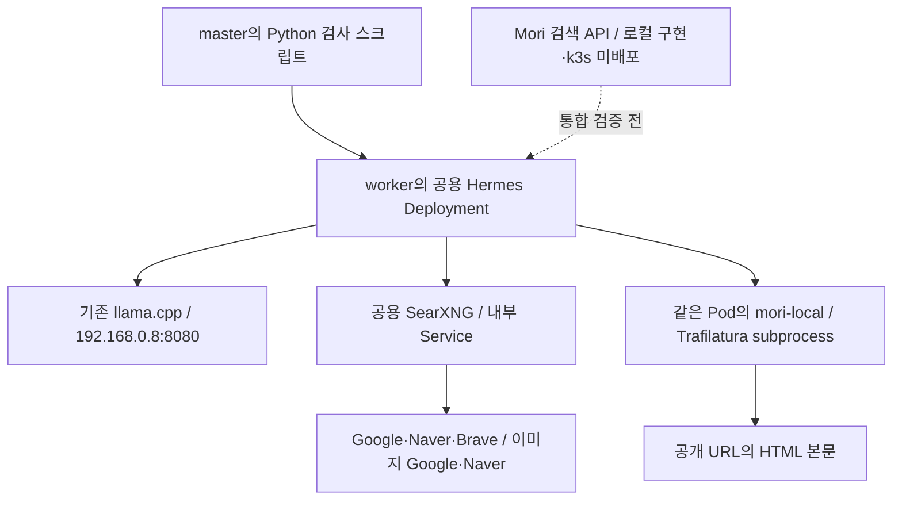

# Hermes 경량화와 자체 호스팅 검색 방향

[전체 계획](../plan.md) · [아키텍처](plan.md) · [공용 Hermes 재개 절차](hermes-shared-resume.md)

갱신일: 2026-09-28. 사용자 의도는 보유한 서버에서 검색을 운영해 외부 검색 API 비용을 피하고 공용/개인 Hermes를 가볍게 유지하는 것이다. **SearXNG 배포·모델 검색, 이미지 후보 도구, 같은 Hermes Pod의 로컬 본문 추출까지 실험 검증했다.** [상세 증거](hermes-web-validation-2026-09-28.md). 실습 리소스 삭제 후 도구를 포함한 이미지·YAML을 `master` `2e2a397`에 구현하고 로컬 기동을 검증했다. 다음은 Harbor 등록·worker 재배포다. 의존성을 제거한 경량 이미지와 개인 실행 환경은 미완료다. [전환 기록](runtime-image-transition.md).

## 1. 실행 이미지와 자원 제한

- 첫 연결은 공식 Hermes 이미지의 고정 버전/digest로 검증한다. 직접 빌드나 Harbor 등록은 선행 필수가 아니다.
- 이후 모리 전용 공통 이미지를 만들고 Free 공용·Pro 개인에 같은 이미지를 사용하는 안을 우선 검토한다. CPU/RAM 차이는 Kubernetes requests/limits로 설정한다. 작은 limits만으로 소프트웨어가 경량화되는 것은 아니다.
- Hermes에는 추론 반복, 도구 호출 클라이언트, 기억·스킬 접근을 남기고, 브라우저·파일 변환·OCR·음성 처리처럼 무거운 실행은 필요할 때 별도 Worker로 분리한다.
- 이미지 크기, 실행 중 RSS, 기동 시간은 서로 다른 지표다. 공식 이미지의 불필요한 의존성 제거는 고정한 버전에서 API·도구·기억 기능의 회귀를 검증하며 진행한다. 특정 메모리 절감량을 약속하지 않는다.
- RTX 3090의 모델 가중치는 기존 독립 llama.cpp 서버에 유지한다. 개인 Hermes마다 모델을 적재하지 않는다.

## 2. 검색과 본문 추출을 구분한다

| 후보 | 역할과 연결 | 현재 판단 |
| --- | --- | --- |
| SearXNG | 외부 검색 엔진들의 결과를 집계. Hermes 기본 `searxng` provider와 JSON API로 연결 | 현장 배포·web_search 시험 통과 후 삭제. Google/Naver/Brave 설정 코드화, 재배포 대기 |
| Trafilatura + Mori provider | 기존 Hermes의 전용 Python 환경에서 HTML 본문 추출, `mori-local` → `web_extract` 연결 | 직접 추출·검색 후 추출 검증, 새 Pod 없음 |
| YaCy | 직접 크롤링·색인하거나 P2P 색인 사용, 컨테이너 제공 | 특정 범위 자체 색인에는 검토 가능. 일반 웹의 범위·최신성을 직접 운영해야 하므로 초기 모리의 우선안은 아님 |
| Crawl4AI | URL 본문 수집·브라우저 처리, 자체 호스팅 API/MCP | 후속 본문 추출 후보. Hermes 도구/어댑터 연결과 버전별 API 검증 필요 |
| Firecrawl 자체 호스팅 | Hermes가 사용자 지정 API 주소를 지원. 본문 수집·추출 등 제공 | 연결 후보지만 API/Worker·브라우저·큐·DB 등 구성 요소가 많아 초기 경량화 목적과 비교 필요 |

SearXNG는 인터넷 전체를 자체 색인하는 서버가 아니다. API 키/유료 계약이 필요 없는 upstream 엔진만 활성화하면 외부 검색 API 사용료 없이 운영할 수 있다. 그래도 전기·CPU/RAM·네트워크·유지보수 비용이 있고 upstream 차단·CAPTCHA·호출 제한이 발생할 수 있다. 자체 호스팅을 무제한·무장애 검색으로 표현하지 않는다. 검색 질의는 설정한 외부 검색 엔진에 전달된다.

Tavily/Brave 등 외부 API의 무료 한도도 비교했지만, 현재의 우선 검증은 자체 호스팅이다. 무료 제공량·요금표를 설계 의존성으로 두지 않는다. 공급자별 원문 저장·재사용 조건도 동일하다고 가정하지 않는다.

## 3. 현장에서 검증한 구조와 재배포 대상


```mermaid
flowchart TD
    Test[master의 Python 검사 스크립트] --> Shared[worker의 공용 Hermes Deployment]
    Mori[Mori 검색 API / 로컬 구현·k3s 미배포] -. 통합 검증 전 .-> Shared
    Shared --> LLM[기존 llama.cpp / 192.168.0.8:8080]
    Shared --> Search[공용 SearXNG / 내부 Service]
    Search --> Upstream[Google·Naver·Brave / 이미지 Google·Naver]
    Shared --> Extract[같은 Pod의 mori-local / Trafilatura subprocess]
    Extract --> Page[공개 URL의 HTML 본문]
```

위 그림은 삭제 전 검증한 연결 및 새 YAML의 재배포 대상이다. 사용자별 Mori 이력 DB·Pro runtime·별도 브라우저/파일 Worker는 후속 설계이며 배포 완료로 표시하지 않는다.

- 배포 명령은 master에서 실행하고 SearXNG workload는 `k3s-infra`의 selector/toleration에 맞춘다.
- 새 구성도 공유 Deployment 1개와 ClusterIP를 사용한다. 별도 검색 GPU, 사용자별 검색 Pod, 공개 Ingress/포트포워딩은 필요하지 않다.
- SearXNG 설정은 ConfigMap/Secret으로 관리하고 JSON 출력을 활성화한다. 이미지 버전/digest를 고정한다. Valkey를 요구하는 limiter 등 기능을 선택하면 그 의존성도 함께 배포한다. 이를 무조건 단일 Pod로 모두 해결된다고 보지 않는다.
- 초기 공유 검색은 상시 운영을 제안한다. 개인 Hermes의 scale-to-zero와 검색 서비스의 수명을 분리한다. 자원 requests/limits·동시 검색 수는 부하를 측정해 정한다.
- JSON 검색에 브라우저 Pod가 필수인 것은 아니다. 링크 본문이나 JavaScript 페이지 처리는 별도로 붙인다.

검증에 사용한 연결 설정의 핵심은 아래와 같다. 전체 ConfigMap·플러그인 설정을 대체하는 apply용 YAML은 아니다. 실제 Service는 `mori-tools/searxng:8080`이다.

```yaml
# Hermes config.yaml
web:
  search_backend: searxng
  extract_backend: mori-local
  keyless_fallback: false
  keyless_rescue: false
```

```text
SEARXNG_URL=http://searxng.mori-tools.svc.cluster.local:8080
```

```yaml
# SearXNG settings.yml의 일부 — 완전한 배포 설정 아님
search:
  formats:
    - html
    - json
```

fallback/rescue는 꺼 둔다. SearXNG는 `web_search`만 제공하며 `web_extract`는 별도로 설치한 `mori_extract` 플러그인이 등록한 `mori-local` provider가 담당한다. 해당 플러그인 없이 provider 이름만 설정해서 동작하는 것은 아니다. 실습에서는 Trafilatura 2.2.0을 PVC의 venv에 설치했으며 새 이미지에서는 `/opt/mori/plugins`와 `/opt/mori/extract-venv`로 코드·의존성 위치를 분리했다. Crawl4AI/Firecrawl 도입은 현재 필수 작업이 아니다.

## 4. 공유 검색과 개인 기록

검색 실행 위치와 기록의 소유자는 별개다. 공용 SearXNG를 사용해도 개인 Hermes는 자신의 맥락·선호로 검색어를 만들고 결과를 해석할 수 있다. 이로써 사용자 이력 저장이 자동 구현되지는 않는다.

- Mori에서 인증 문맥으로 `user_id`, `conversation_id`, `run_id`를 결정한다. 모델이 제안한 사용자 ID를 권한으로 신뢰하지 않는다.
- 도구 실행 이력에 검색어·시각·실제 제공자·성공/오류·출처를 연결한다. 원문/요약 보관 범위·기간은 제공자 조건과 제품 삭제 정책에 맞춰 정한다.
- 공용 SearXNG에는 검색에 필요한 질의만 보내고 개인 대화 전체나 내부 사용자 식별자를 불필요하게 넘기지 않는다.
- 개인화 이력은 Mori DB와 사용자별 Hermes 상태에 둔다. 공유 검색 로그를 개인 기억 저장소로 사용하지 않는다.
- 검색/본문/브라우저 캐시, 쿠키, 파일, 삭제 범위는 사용자 경계에 맞춘다. 도구 분리만으로 사용자 격리가 보장되지는 않는다.
- 로컬 추출 worker에는 공개 주소·리다이렉트 검증, 응답 크기·시간 제한을 구현했다. 별도 Worker로 분리하더라도 같은 경계를 유지하고 동시 실행 한도를 실측한다. 웹페이지 지시는 실행 권한으로 취급하지 않는다.

## 5. 현재 상태와 인수 기준

| 구간 | 상태 | 다음 확인 |
| --- | --- | --- |
| 공용 Hermes↔llama.cpp 대화 | 현장 통과 | 정식 이미지 교체 후 회귀 |
| SearXNG JSON·모델 web_search | 현장 통과 | 재구성한 settings의 한국어 질의 회귀·차단/부하 |
| 이미지 후보·모델 간접 호출 | 현장 통과 | 실제 이미지 로딩·관련성·프론트 표시 |
| 로컬 web_extract·검색 후 추출 | 현장 통과 | 고정 의존성의 실환경 적용, 다른 사이트·실패 회귀 |
| Mori 검색 Adapter·임시 인증 | 로컬 구현·모의 상류 테스트 | 실제 API→Hermes 호출·인증 비활성화 |
| 사용자별 도구 이력·격리 | 미구현 | 두 계정의 접근 경계와 삭제/보관 계약 |
| 별도 브라우저·파일 Worker | 후속 | 현재 로컬 추출 한계·자원 측정 후 필요 범위 결정 |

검색 품질은 상위 결과 관련성·기관 일치·출처·최신성으로 따로 평가한다. CAPTCHA 없는 몇 회의 결과를 장기 안정성으로 일반화하지 않는다. 환승 도구는 미구현이며 지도 검색 카테고리 추가만으로 해결된 것으로 보지 않는다.

실습 삭제와 이미지/YAML 구현은 완료했고 현재 우선순위는 [Harbor 등록 → 새 PVC 재배포 → 실환경 회귀](runtime-image-transition.md)다. 이후 주차 도구를 연결한다. 검색은 주차 저장의 필수 의존성이 아니며 실제 Hermes Knative 전환도 별도 단계로 관리한다.

## 공식 근거

아래 외부 문서는 2026-09-21 설계 당시 참고한 근거다. 이번 갱신은 사용자 실행 로그와 실습 코드에 근거하며 외부 문서를 새로 확인한 기록은 아니다. 제품 버전 선택 시 구현과 문서의 차이를 다시 확인한다.

- [Hermes Web Search & Extract](https://hermes-agent.nousresearch.com/docs/user-guide/features/web-search): SearXNG, 검색/추출 분리, self-hosted Firecrawl 주소, keyless 설정.
- [Hermes Docker](https://hermes-agent.nousresearch.com/docs/user-guide/docker): 공식 이미지, Gateway API, `/opt/data` 상태 보존.
- [SearXNG 컨테이너](https://docs.searxng.org/admin/installation-docker.html), [검색 API](https://docs.searxng.org/dev/search_api.html), [limiter](https://docs.searxng.org/admin/searx.limiter.html): 배포, JSON, upstream 차단과 Valkey 의존성.
- [YaCy](https://yacy.net/), [컨테이너 설치](https://www.yacy.net/download_installation/): 자체 색인/P2P와 Docker 지원.
- [Crawl4AI 자체 호스팅](https://docs.crawl4ai.com/core/self-hosting/): 서버·API·본문 추출. 버전별 인증·기본값 차이는 선택한 릴리스로 검증한다.
- [Firecrawl 자체 호스팅](https://github.com/firecrawl/firecrawl/blob/main/SELF_HOST.md): 구성 요소, Kubernetes 예시, 버전 고정 필요.
