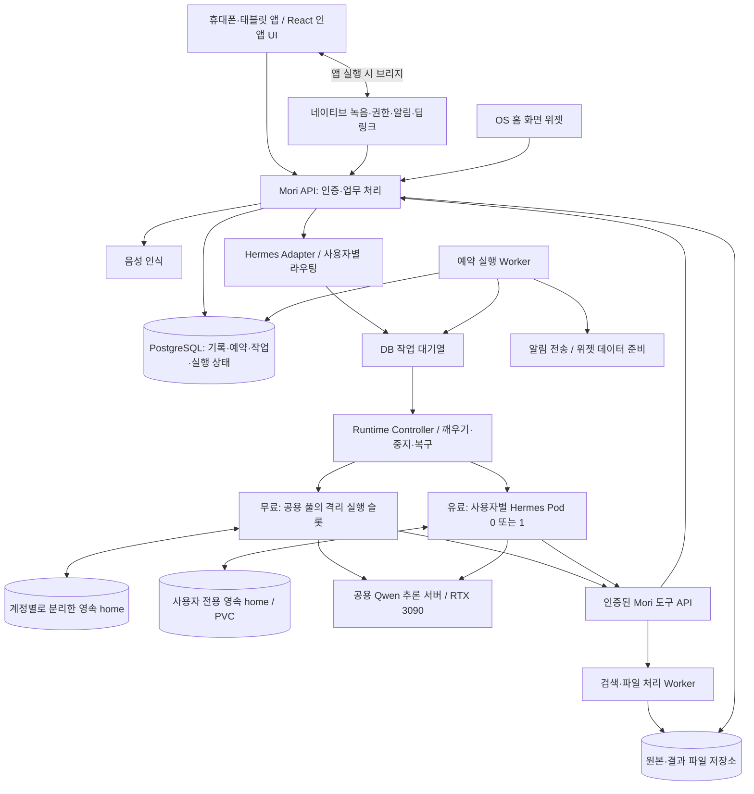
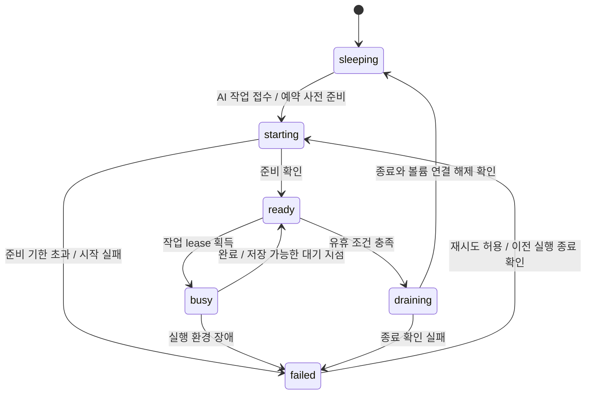

# Architecture — 시스템·인프라 설계

[전체 계획으로 돌아가기](../plan.md)

갱신일: 2026-09-17 · 상태: 앱 우선 방향과 유료 실행 환경의 유휴 중지·요청 시 재기동을 반영한 설계. 세부 자원·시간 값은 실측 전 제안이다. 기능·요금제의 기준은 [전체 계획](../plan.md)이며, 여기서는 실행 구조를 다룬다.

## 1. 전체 구조

그림의 상자는 논리적인 책임이다. 초기에는 단일 백엔드 코드베이스의 API·Worker·제어 프로세스로 구성한다. 제품은 휴대폰·태블릿 앱이며 브라우저는 개발·PoC 확인에 사용한다. 앱은 Mori API에 연결하고 Hermes·DB·GPU·Pod 관리 API는 내부망에 둔다.

React 인앱 UI와 네이티브 기능을 브리지로 연결하는 방안을 검증한다. 앱 컨테이너는 Capacitor와 React Native + WebView를 비교한 뒤 선택한다. OS 위젯은 별도 구현하고, 열린 WebView나 사용자 Hermes Pod에 의존하지 않는 조회 경로를 둔다. 화면·위젯·브리지는 실제 제품에서 사용자 담당이다. [프론트 앱 설계](../front/plan.md#10-휴대폰태블릿-앱-우선-설계).

앱 UI·네이티브 알림 응답은 같은 인증된 작업·승인 API를 사용한다. 승인과 실행 상태는 서버에 보존하고, 앱 종료·재접속·여러 기기의 중복 응답을 처리한다. 앱/WebView/브리지 버전 호환은 앱 계약에서 검증한다.

간단한 기록 조회, 캘린더 조회, 이미 정해진 알림 전송에는 LLM을 호출하지 않는다. 자연어 해석, 여러 도구를 조합하는 작업, 스킬 생성처럼 필요한 부분에만 Hermes와 LLM을 사용한다.

## 2. 무료 공용 실행과 유료 전용 Pod

| 항목 | 무료 기본 사용자 | 유료 사용자 |
| --- | --- | --- |
| 실행 자원 | 제한된 공용 Worker/실행 슬롯을 나눠 쓴다. | 사용자 전용 실행 정의를 유지하고 Pod는 필요 시 0→1, 유휴 시 1→0으로 조절한다. |
| Hermes 상태 | 사용자별 profile/home, 대화·기억·스킬 분리 | 사용자별 profile/home과 전용 영속 볼륨 |
| LLM | 공용 추론 서버 | 같은 공용 추론 서버 |
| 스케줄 | Mori 스케줄러가 필요 시 실행 요청 | Mori 스케줄러가 AI 작업 전에 깨우고, 준비된 전용 Pod로 실행 요청 |
| 제한 | 사용자별 호출량·작업 길이·동시 실행 제한 | Pod CPU·RAM 제한과 별도의 LLM 사용량 제한 |
| 지속성 | 실행이 끝나도 개인 데이터는 유지 | Pod가 없어도 DB·전용 home·파일·위젯 설정 유지 |
| 등록 정책 | 논리적 비서·위젯 각각 약 3개, 정확한 집계는 미정 | 논리적 등록 개수 제한 없음. Pod 수·동시 작업·저장량은 별도 정책 |

### 공용 실행의 경계

하나의 Hermes 기본 홈과 프로세스를 모든 사용자에게 그대로 노출하는 구조는 채택하지 않는다. 공식 API 문서는 사용자별 config·memory·skills를 분리하기 위해 profiles를 안내한다. 세션 ID만 바꾸는 것으로 모든 저장 상태가 격리된다고 가정하지 않는다. [Hermes API 문서](https://hermes-agent.nousresearch.com/docs/user-guide/features/api-server).

초기 제안은 **공용 호스트/Worker가 요청 시 사용자별 격리 실행 환경을 시작하고, 그 사용자 저장 공간만 연결하는 방식**이다. 사용자마다 상시 전용 Pod를 유지하지 않으므로 자원을 공유할 수 있다. 격리 단위와 시작 비용은 A-03에서 검증한다.

- 프로필 분리는 애플리케이션 상태 분리다. 임의 코드를 실행하는 환경의 보안 경계까지 보장하지는 않는다.
- 파일·터미널·브라우저 실행은 해당 사용자 작업 공간만 볼 수 있는 제한된 컨테이너 등에서 수행한다.
- 공용 프로세스에서 전역 환경 변수나 기본 홈을 요청마다 바꾸는 방식은 피한다.
- 도구 접근은 백엔드가 발급한 사용자·작업 범위 인증으로 제한한다. 프롬프트의 ‘다른 사용자 데이터에 접근하지 말라’는 문구에 의존하지 않는다.
- 격리가 검증되기 전에는 한 사람의 알파만 운영한다. 무료 다중 사용자 제공의 선행 조건으로 삼는다.

### 유료 Pod 운영과 등록 단위

**개인화 상태는 계속 보관하고, 실행 Pod는 사용 중일 때만 켜는 방식을 기본 설계로 둔다.** 유료의 전용성은 사용자 전용 데이터와 실행 경계를 뜻한다. 상시 실행·즉시 응답·전용 GPU를 요금제 조건으로 약속하지 않는다. 무료도 계정별 기억·스킬은 보존하며 기본 기능은 같다.

앱에서 등록하는 `Assistant`와 인프라의 `AgentRuntime`을 분리한다. 초기 제안은 사용자당 전용 runtime 하나, 실행 Pod 최대 하나이며 여러 논리적 비서의 작업은 직렬 처리한다. 비서를 추가할 때마다 Pod를 하나씩 만드는 구조는 피한다. 비서별 역할·대화·스킬 참조를 `assistant_id`로 구분하고 Hermes profile 매핑은 A-03에서 검증한다. 같은 home에 여러 Hermes 프로세스가 동시에 쓰지 않게 한다. Hermes 공식 문서도 profile을 별도의 home으로 설명하고 동시 작성자를 피하도록 안내한다. [Hermes profiles](https://hermes-agent.nousresearch.com/docs/user-guide/profiles/).

CPU·메모리 한도, 최대 활성 사용자 수는 실측 후 정한다. 출발 예시는 `requests: CPU 250m / RAM 512Mi`, `limits: CPU 1 / RAM 2Gi`이며 검증된 최소 사양이 아니다. 브라우저·파일 처리는 별도 제한된 Worker로 보내고 비용을 사용자 사용량에 포함한다. CPU·메모리·디스크 한도를 각각 적용하며 작업 상태는 메모리에만 두지 않는다.

Pod별 home/PVC, 서비스 인증, 비특권 실행, 최소 권한과 기본 차단 NetworkPolicy를 둔다. 임의 코드가 필요한 경우 별도 sandbox를 검증한다. 에이전트에 Kubernetes 관리 권한을 주지 않고, 별도 Runtime Controller만 허용된 사용자 workload의 생성·scale·상태 확인 권한을 가진다.

### 유휴 중지와 콜드 스타트

여기서 **scale-to-zero**는 유휴 Pod를 0개로 줄이는 정책이고, **cold start**는 다음 요청 때 새 Pod를 띄워 준비하는 과정이다. 프로세스 메모리를 얼렸다 그대로 복원하는 기능을 뜻하지 않는다. 메모리의 미완료 추론을 보존한다고 가정하지 않고, 저장된 작업·세션·도구 결과에서 재개 가능한 지점을 확인한다.

| 구성요소 | 유휴 시 정책 | 깨우는 조건 |
| --- | --- | --- |
| 유료 Hermes 실행 Pod | 사용자별 0개, 활성 시 1개 | 인증된 AI 요청, 유효한 후속 답변·승인, AI 예약 작업 |
| 사용자 home / PVC | 유지, Pod 종료와 삭제 수명주기 분리 | 같은 저장 공간을 재연결 |
| DB·파일·예약·위젯 snapshot | 유지 | 조회는 Mori API/Worker가 처리 |
| API·스케줄러·Runtime Controller | 서버 운영 시간 동안 상시 가동 | Pod가 없는 상태에서도 요청을 접수하고 깨울 수 있어야 함 |
| 공용 GPU 추론 서버 | 초기에는 모델을 적재한 상태 유지 | 사용자 Pod마다 모델을 다시 적재하지 않음 |

이 정책이 줄이는 것은 유휴 Hermes 프로세스의 CPU·RAM 점유다. 영속 저장소, Kubernetes·DB 등의 기본 자원과 공용 GPU의 전력·VRAM까지 0으로 만들지는 않는다. GPU 자체 유휴 종료는 전체 사용자의 재적재 지연을 측정한 뒤 별도 결정한다.

Kubernetes 실행 방식의 첫 후보는 사용자별 Deployment의 `replicas: 0/1`, 내부 Service, 독립적으로 관리하는 PVC다. 이미지 digest와 의존성을 고정해 미리 준비하며 부팅마다 패키지를 설치하지 않는다. Controller만 replica 수를 조절하고 배포 도구나 별도 autoscaler가 이를 덮어쓰지 않게 한다. [Deployment scaling](https://kubernetes.io/docs/concepts/workloads/controllers/deployment/#scaling-a-deployment).

#### 실행 상태와 요청 경로

아래는 Mori가 관리하는 runtime 상태이며 Kubernetes Pod phase와 별개다. 공통 업무 작업 상태와도 분리한다.

1. API가 인증·요금제·입력·멱등 키를 확인해 DB에 작업과 outbox를 저장한다. 긴 HTTP 연결로 기동을 기다리게 하지 않고 `202 Accepted`와 `run_id`를 반환한다.
2. 단순 기록·일정·위젯 조회는 도메인 API에서 끝낸다. 앱 진입, health check, 상태 polling, 열린 SSE 연결만으로 Pod를 깨우거나 유휴 시간을 연장하지 않는다.
3. Dispatcher가 AI 작업의 사용자 runtime을 조회한다. `sleeping`이면 사용자 단위 잠금/lease와 generation을 사용해 깨우기를 한 번만 요청한다. 동시 요청은 같은 기동 결과를 기다린다.
4. Controller는 전역 활성 Pod·동시 기동 상한, CPU·RAM 여유와 GPU 대기열을 확인한 뒤 생성한다. 부족하면 DB 큐에서 기다리고 대기 기한·취소·사용자별 공정성을 적용한다. 무제한 등록을 무제한 동시 기동으로 해석하지 않는다.
5. 사용자 볼륨 연결, Hermes 설정·버전·실행 API의 준비를 확인한다. startup/readiness probe의 실제 경로는 고정한 Hermes 버전 또는 Adapter로 검증한다. liveness는 외부 GPU 지연만으로 Pod를 반복 재시작하지 않게 분리한다. [Kubernetes probes](https://kubernetes.io/docs/concepts/workloads/pods/probes/).
6. Dispatcher가 유효한 runtime generation과 작업 lease를 다시 확인해 작업을 전달한다. 앱에는 `run.status=queued`와 `wait_reason=agent_starting` 또는 `capacity`를 전달하고, 업무 실행이 시작될 때 `running`으로 바꾼다.
7. 사용자 입력·승인 대기 중에는 continuation과 필요한 도구 결과를 저장한 경우에만 Pod를 내려도 된다. 선택한 Hermes API가 안전한 중단·재개를 지원하는지 먼저 검증한다. 불가능하면 해당 대기 작업을 기한까지 유지하거나 명시적인 실패로 종료하며, 실행 중인 추론을 조용히 버리지 않는다.

#### 안전하게 중지하기

유휴 판단은 최근 화면 조작 시각이 아니라 **실행 중인 작업·도구·파일 쓰기·외부 결과 대기와 예약 사전 준비 유무**를 기준으로 한다. CPU가 낮거나 사용자가 앱을 닫았다는 이유만으로 중지하지 않는다.

- 마지막 실제 작업 완료 후 유휴 시간이 지나고, 미전달 AI 작업·실행 lease·필요한 사전 준비가 없을 때 중지 후보가 된다.
- Controller가 원자적으로 `draining`으로 전환하면 새 dispatch를 차단한다. 동시에 도착한 요청은 DB 큐에 남기고 기존 Pod 종료를 확인한 뒤 한 번만 재기동한다.
- 세션·스킬·메모리 기록을 마무리하고 정상 종료를 요청한다. `terminationGracePeriodSeconds`는 flush 시간을 측정해 정한다. Kubernetes의 종료 유예가 만료되면 강제 종료될 수 있으므로 안전성은 lease·멱등성·외부 효과 대조로 보완한다. [Pod termination](https://kubernetes.io/docs/concepts/workloads/pods/pod-lifecycle/#pod-termination).
- PVC는 독립 자원으로 유지하고 유휴 중지 때 삭제하지 않는다. 재부착·Pod 재생성 시험과 백업 복원을 각각 수행한다. `ReadWriteOnce`만으로 같은 노드의 단일 작성자를 보장한다고 가정하지 않는다. 지원 CSI에서는 `ReadWriteOncePod`를 검토한다. [Persistent volumes](https://kubernetes.io/docs/concepts/storage/persistent-volumes/#access-modes).
- 업데이트에는 `Recreate`를 우선 검토하되, 이것만으로 장애·수동 삭제 시의 중복 실행이 해결되지는 않는다. generation 검증은 오래된 실행의 도구 호출을 거부하고, home의 동시 쓰기는 이전 프로세스 종료·볼륨 해제 확인으로 막는다. 노드 단절 등으로 종료가 불명확하면 새 작성자를 띄우지 않고 복구 대기로 둔다.
- Controller가 재시작하면 DB의 의도와 실제 Pod/lease 상태를 대조한다. 타임아웃 후 늦게 준비된 Pod, 취소된 요청, 종료 실패를 수습하며 `starting`에 영구 정체되지 않게 한다.

#### 예약 작업과 사전 준비

일정과 cron의 소유자는 계속 Mori 스케줄러다. 사용자 Pod에 타이머를 넣지 않는다. 주차 표시·기존 일정 알림은 Pod가 없는 상태에서도 처리한다.

AI가 필요한 코스피 정기 브리핑·검색·개인 스킬은 실행 예정 시각보다 먼저 Pod를 준비하는 **prewarm**을 사용한다. `prewarm_at = scheduled_at - 준비 여유 시간`으로 계산하고, 여유 시간은 cold-start p95와 변동 폭을 측정해 조정한다. 미리 깨운 Pod는 해당 회차까지 유지하되 예약 취소·변경·만료 시 유지 사유를 해제한다. 검색 등 실제 업무는 예정 시각 전에 실행하지 않는다.

‘09:30에 검색 시작’과 ‘09:30까지 결과 전달’은 다른 약속이다. `scheduled_at`은 작업 시작 예정 시각, `delivery_deadline`은 결과가 필요한 시각으로 구분한다. 사용자가 결과 도착 시각을 지정했다면 검색·추론·파일 생성 시간을 고려해 시작 시각을 산정하고, 해석이 모호하면 필요한 것만 확인한다. 정확한 전달 보장은 전체 처리 시간을 측정한 뒤 결정한다. 같은 시각 요청이 몰리면 기동을 분산하되, 실행 지연을 숨기지 않고 허용 지연 초과 시 작업별 건너뛰기·실패 정책을 적용한다.

사전 준비 중복과 실제 실행 중복은 별개로 막는다. 동일 사용자 기동은 하나로 합치고, 예약 회차는 `automation_id + scheduled_at`로 식별해 작업을 한 번 생성한다. 전용 환경 시작 실패를 이유로 사용자 상태를 공용 Hermes에 자동 연결하지 않는다.

#### 초기 구현과 조정할 값

처음에는 DB 작업 큐와 작은 Runtime Controller를 사용한다. HTTP 트래픽만으로는 승인 대기·예약·도구 실행 여부를 알 수 없기 때문이다. KEDA/Knative 도입은 규모가 커질 때 비교한다. KEDA HTTP Add-on에는 0개인 backend가 준비될 때까지 요청을 보관하는 기능이 있으나, Mori의 작업 영속성·사용자 격리·단일 작성자까지 대신하지는 않는다. [KEDA cold-start 처리](https://keda.sh/http-add-on/0.15/user-guide/configure-cold-start/).

| 항목 | 시작 제안 / 결정 기준 |
| --- | --- |
| 유휴 중지 | 마지막 작업 완료 후 10분을 실험 시작값으로 두고 5·10·30분을 비교. 확정 요금제 조건 아님 |
| 준비 기한·종료 유예 | 이미지 캐시 유무, 볼륨 연결, Hermes 복원 시간을 측정해 설정. 무한 대기는 금지 |
| 사전 준비 여유 | cold-start p95 + 여유 시간. 예약 회차에 연결하고 지나친 조기 기동 제한 |
| 작업/큐 기한 | 작업 종류별 대기·실행·허용 지연과 취소 정책을 분리 |
| 활성 Pod·동시 기동 수 | 호스트 메모리·CPU와 GPU 큐 부하를 기준으로 전역 상한 설정 |
| 대화 사용감 | 같은 대화의 연속 요청은 warm 상태 재사용. 마지막 완료 후 유휴 시간부터 다시 계산 |

A-05에서는 warm/cold 시작 p50·p95, 이미지 미캐시·재부착 시간, 준비 실패율, 유휴 메모리 감소, 사용자 대기·예약 지연을 함께 측정한다. runtime 준비 시간과 LLM 첫 응답 시간을 분리한다. 이 결과 없이 ‘몇 초 안에 항상 응답’이나 절감률을 약속하지 않는다.

## 3. RTX 3090과 모델 운영

RTX 3090의 공식 메모리 사양은 24GB다. 이 GPU에 모델을 한 번 적재하는 공용 추론 서버를 두고 무료/유료 에이전트가 호출하도록 제안한다. [NVIDIA 사양](https://www.nvidia.com/en-us/geforce/graphics-cards/30-series/rtx-3090-3090ti/).

`Qwen3.8`은 계열명으로 취급한다. 공식 `Qwen/Qwen3.8-27B`는 후보이며 정확한 모델 ID·리비전·양자화 파일·라이선스와 호환 엔진 버전을 선택해야 한다. `Qwen3-8B`와는 다른 명칭이다. [공식 모델 카드](https://huggingface.co/Qwen/Qwen3.8-27B).

27B 가중치를 단순히 16bit로 계산하면 약 54GB, 4bit로 계산하면 약 13.5GB이다. 이 수치는 파라미터 수에 비트 수를 곱한 대략적인 가중치 계산이며, 실제 적재량이나 실행 가능성의 보장이 아니다. 양자화 메타데이터, KV 캐시·추론 상태, 컨텍스트 길이, 런타임 버퍼와 다른 GPU 작업이 추가된다.

따라서 4bit 계열 양자화를 첫 검증 후보로 삼는다. 추론 엔진은 선택한 양자화와 3090에서의 지원을 먼저 확인하며, `llama.cpp` 계열과 `vLLM` 등을 비교한다. 공식 vLLM recipe가 있다는 사실만으로 3090에 해당 구성 그대로 적재할 수 있다고 판단하지 않는다. [vLLM Qwen3.8-27B recipe](https://recipes.vllm.ai/Qwen/Qwen3.8-27B).

측정 항목:

- 한국어 주차·일정 발화의 정보 추출 정확도와 도구 인자 유효성.
- 첫 응답 지연, 전체 처리 시간, 토큰 생성 속도, GPU 최대 메모리.
- 도구 호출 → 실행 결과 읽기 → 최종 응답까지의 성공률과 반복 호출 여부.
- 동시 요청 1개부터 시작해 증가시켰을 때 대기 시간과 메모리 초과 여부.
- STT를 함께 사용할 때의 자원 경쟁. 초기에는 CPU STT 등 분리 경로도 비교한다.

짧은 입력 처리와 여행 계획의 추론 예산을 다르게 주고, 요청별 최대 출력·도구 단계·시간·재시도 횟수를 제한한다. 기본 동시 추론 수는 측정 전 1개로 제한해 시작한다. 큐에는 대기 만료·취소를 두며 특정 사용자나 긴 작업이 전체를 독점하지 않게 한다.

**전용 Pod 수를 늘려도 GPU 처리량이 늘어나지는 않는다.** 유료 전용 실행과 전용 GPU는 다른 개념이다. 동시 사용자 수와 요금제 한도는 모델 측정과 호스트 CPU·RAM 확인 뒤 산정한다.

## 4. 스케줄링의 기준과 책임

Mori PostgreSQL에 일정·반복 규칙·다음 실행 시각·실행 이력을 저장하고, Mori Worker가 실행 시점을 결정하는 방식을 제안한다. 이 데이터는 무료 실행 풀이나 유료 Pod의 생명주기와 독립적이다.

Hermes에도 자체 cron이 있다. 다만 제품 예약 작업을 Mori와 Hermes 양쪽에서 동시에 실행하면 중복 발생과 복구 판단이 어려워진다. 초기 제품 작업은 Mori가 소유하고, 에이전트의 예약 요청은 Mori의 도구 API로 저장한다. Hermes 내장 cron은 이 작업들에 대해 실행하지 않도록 통합 시 검증한다. [Hermes 예약 작업](https://hermes-agent.nousresearch.com/docs/user-guide/features/cron).

| 예약 작업 종류 | 실행 방식 |
| --- | --- |
| 아침에 최신 주차 위치 표시 | DB 조회 → 대시보드/위젯 데이터 준비. 매번 LLM을 호출하지 않는다. |
| 일정 시작 전 알림 | 이미 저장된 일정과 알림 규칙을 읽어 전송한다. |
| 매주 여행 정보 다시 조사 | 실행 시점에 사용자 Hermes를 호출하고 결과를 작업으로 저장한다. |
| 새로 만든 개인 스킬 실행 | 버전·권한·입력 데이터를 고정해 호출한다. |

예약 시각과 실제 실행 시각을 구분한다. 시간대와 반복 규칙을 함께 저장하고 재시작 후 지연 작업 처리 정책을 적용한다. `automation_id + scheduled_at` 등의 실행 키로 같은 회차의 중복 효과를 방지한다. 외부 호출 결과가 불명확하면 조회·대조한 뒤 재시도한다.

## 5. 개인 프로젝트에 맞춘 배포 단계

### 개인 알파

- 모듈을 구분한 단일 백엔드 코드베이스와 API/Worker 실행 프로세스.
- PostgreSQL, 제한된 Hermes 실행기, 공용 모델 서버, 음성 인식 경로.
- 초기에는 DB 기반 작업 큐와 로컬 파일 저장소로 운영하고, 서비스와 파일 저장 인터페이스를 분리한다.
- 컨테이너 실행 구성으로 시작하고 DB 큐·runtime 상태·요청 시 시작·유휴 중지 계약을 먼저 검증한다. P1의 소규모 기동 실험과 P4의 유료 운영을 구분하며, 대규모 클러스터는 선행 구축하지 않는다.

### 유료 제공 전

- 단일 노드 Kubernetes/k3s 등을 후보로 사용자별 Pod 0/1·독립 PVC·Runtime Controller·기동/종료 한도·자원 제한을 구현한다. A-05의 재개·중복 방지 시험을 통과해야 유료 제공한다.
- 모델 서버는 별도 프로세스/컨테이너로 유지할 수 있다. 클러스터 내부 편입은 운영 이점이 있을 때 선택한다.
- 무료/유료 전환에서 사용자 저장 공간의 동시 쓰기를 막고, 작업을 잠시 비운 뒤 라우팅을 원자적으로 전환한다.
- 실패하면 이전 라우팅을 유지하며, 이전·해지 과정에서 데이터가 바로 삭제되지 않게 한다. 보관 정책은 별도 확정한다.

백엔드는 Python + FastAPI, DB는 PostgreSQL을 시작 후보로 제안한다. Hermes 연동·음성·문서 처리를 한 언어에서 다루기 쉽다는 설계 판단이며 확정 기술은 아니다. Redis, 별도 벡터 DB, 메시지 브로커, 다수 마이크로서비스는 필요성이 생기면 추가한다.

## 6. 장애·데이터·운영

| 상황 | 기대 동작 |
| --- | --- |
| GPU 추론 장애 | 기존 기록·캘린더 조회와 이미 등록된 단순 알림은 CPU 서비스가 살아 있으면 유지. AI 요청은 대기/실패 상태를 표시한다. |
| Hermes Pod 재시작 | DB의 작업과 영속 home을 기준으로 복구. 외부 작업을 무조건 반복하지 않는다. |
| 사용자 Pod 유휴 중지 | 정상 상태로 취급. 조회는 API로 제공하고 AI 요청만 준비 대기로 전환한다. |
| 시작 실패·전역 자원 부족 | 입력과 run_id를 보존하고 재시도 가능 여부·기한을 표시. 무한 기동이나 공용 환경으로의 임의 전환 금지 |
| 집 서버/전원/인터넷 전체 장애 | 서버 기능과 새 전송은 중단된다. 휴대폰은 캐시된 카드와 미리 받은 일정 범위만 표시한다. |
| DB 장애 | 완료를 가장하지 않고 저장 실패를 표시. 재시도와 백업 복원을 준비한다. |
| 알림 전달 지연 | 서버 발송 성공과 기기 수신·표시를 구분하고 실행 이력에 남긴다. |

Mori DB와 Hermes home은 용도가 다르므로 함께 백업한다. DB는 제품 기록의 기준이고, Hermes home은 개인 스킬·메모리·실행 상태를 보존한다. 파일 결과물과 버전도 복구 대상에 포함한다. 복원 테스트 없이 ‘백업 완료’를 가용성 보장으로 취급하지 않는다.

로그에는 작업 ID, 성공/실패, 지연, 자원 사용량을 우선 남기고 원음·인증 토큰·개인 기록 전체를 기본으로 남기지 않는다. 사용자 요청 삭제는 DB·Hermes 상태·파일·캐시와 백업 만료 정책까지 연결한다.

기본 보관 기간, 암호화 키 관리, 백업 위치, 운영 시간은 배포 전 결정한다. 집 서버 하나에 모두 두는 초기 구성이므로 고가용성이나 24시간 전달을 보장하지 않는다. GPU와 API/스케줄러 호스트를 분리하는 것은 이후 운영 선택지다.

## 7. 구현 전 통과할 검증

- 서로 다른 두 계정의 세션·기억·스킬·파일·도구 결과가 섞이지 않는다.
- 다른 사용자의 ID/파일 경로/프로필 이름을 넣어도 접근하지 못한다.
- 모델 과부하에서 대기와 취소가 동작하고 단순 조회·예약 알림이 함께 멈추지 않는다.
- Pod 제거·Worker 재시작·중복 요청에도 주차 기록·일정·파일 효과가 중복되지 않는다.
- CPU·메모리·디스크 제한 초과가 다른 사용자의 상태를 손상시키지 않는다.
- 무료 ↔ 유료 전환 후 동일한 기억·스킬·예약이 이어지고 실행 주체는 하나다.
- 서버 전체 장애와 복구 시 미실행 작업의 처리 정책이 확인된다.

### 유휴 중지·재기동 인수 시나리오

- 동일 사용자에게 요청 여러 개가 동시에 들어와도 Pod 1개·유효 작성자 1개만 실행된다.
- idle 중지 판정과 새 요청이 경합해도 요청이 유실되지 않고 같은 업무 효과가 중복되지 않는다.
- 긴 검색·파일 생성·도구 응답 대기·저장 미완료 때 중지되지 않는다. 저장된 승인 대기는 재기동 후 이어진다.
- Pod 0개에서 앱 주차 조회·위젯 snapshot·일반 일정 알림이 동작하고 polling이 Pod를 깨우지 않는다.
- 예약 prewarm과 직접 요청이 겹쳐도 한 번 기동하며 예약 취소·시간 변경·전원 장애 후 정책대로 처리된다.
- 시작 실패, 이미지 미캐시, 볼륨 재부착 실패, 강제 종료, Controller 재시작에서 기한 내 상태가 정리된다.
- 재기동 뒤 대화·개인 스킬·설정·원본/결과 파일이 같고, 다른 사용자의 데이터가 연결되지 않는다.
- scale-to-zero·업데이트·무료↔유료 전환·해지 작업이 경합해도 실행 generation과 저장 공간의 단일 작성자를 유지한다.

2026-09-17 공식 자료를 확인해 콜드 스타트 관련 근거를 추가했다. 위 상태 모델·API·Controller·시간 값은 Mori 설계 제안이며 아직 배포·측정하지 않았다.
