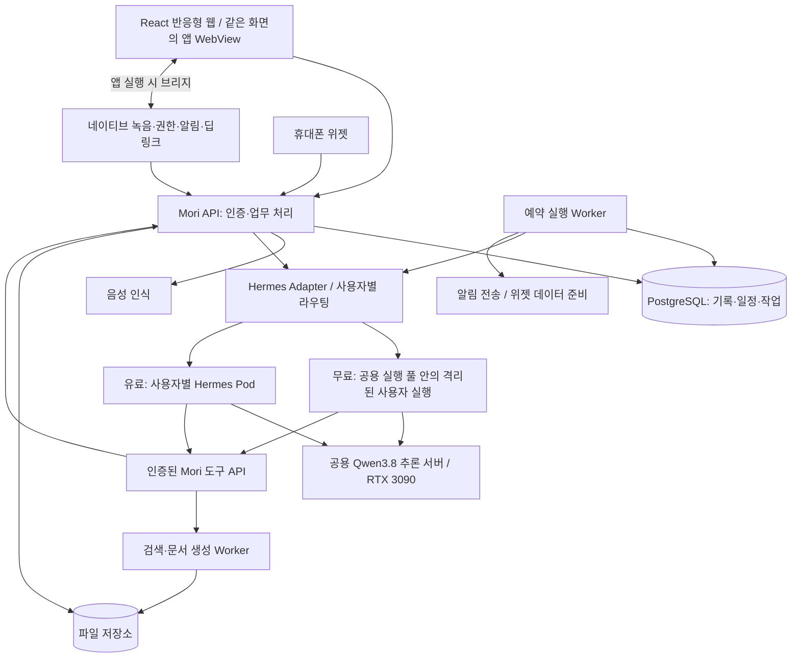

# Architecture — 시스템·인프라 설계

[전체 계획으로 돌아가기](../plan.md)

상태: 검토용 제안. 사용자가 확정한 방향은 Hermes 기반 비서, 무료 공용 실행, 유료 사용자별 Pod, RTX 3090 로컬 Qwen3.8이다.

## 1. 전체 구조

그림의 상자는 논리적인 책임을 뜻한다. 처음부터 모두 별도의 서비스나 서버로 분리하지 않는다. 앱은 Mori API에 연결하고, Hermes·DB·GPU·Pod 관리 API는 내부망에 둔다.

React 웹은 초기 실제 제품이다. 이후 모바일 앱은 같은 React 화면을 WebView로 재사용하고, 브리지를 통해 네이티브 녹음·권한·푸시·로컬 알림·딥링크를 연결한다. OS 위젯은 별도 구현하며 열린 WebView에 의존하지 않는 데이터 경로를 둔다. 앱 컨테이너는 Capacitor와 React Native + WebView를 비교한 뒤 선택한다.

웹과 앱은 같은 기록·일정·작업·승인 API를 사용한다. 실행 승인 상태는 서버에 보존해 웹과 앱의 중복 응답을 일관되게 처리한다. 앱·웹·브리지의 버전과 지원 기능을 확인하고, 모바일 앱의 백그라운드 상시 실행에 에이전트 작업을 의존시키지 않는다. 상세 책임과 검증 기준은 [프론트 확장 계획](../front/plan.md#10-react-반응형-웹에서-모바일-앱으로-확장)에 둔다.

간단한 기록 조회, 캘린더 조회, 이미 정해진 알림 전송에는 LLM을 호출하지 않는다. 자연어 해석, 여러 도구를 조합하는 작업, 스킬 생성처럼 필요한 부분에만 Hermes와 LLM을 사용한다.

## 2. 무료 공용 실행과 유료 전용 Pod

| 항목 | 무료 기본 사용자 | 유료 사용자 |
| --- | --- | --- |
| 실행 자원 | 제한된 공용 Worker/실행 슬롯을 여러 사용자가 나눠 쓴다. | 사용자별 Hermes Pod를 할당한다. |
| Hermes 상태 | 사용자별 profile/home, 대화·기억·스킬 분리 | 사용자별 profile/home과 전용 영속 볼륨 |
| LLM | 공용 추론 서버 | 같은 공용 추론 서버 |
| 스케줄 | Mori 스케줄러가 필요 시 실행 요청 | Mori 스케줄러가 전용 Pod로 실행 요청 |
| 제한 | 사용자별 호출량·작업 길이·동시 실행 제한 | Pod CPU·RAM 제한과 별도의 LLM 사용량 제한 |
| 지속성 | 실행이 끝나도 개인 데이터는 유지 | Pod가 재생성되어도 개인 데이터는 유지 |

### 공용 실행의 경계

하나의 Hermes 기본 홈과 프로세스를 모든 사용자에게 그대로 노출하는 구조는 채택하지 않는다. 공식 API 문서는 사용자별 config·memory·skills를 분리하기 위해 profiles를 안내한다. 세션 ID만 바꾸는 것으로 모든 저장 상태가 격리된다고 가정하지 않는다. [Hermes API 문서](https://hermes-agent.nousresearch.com/docs/user-guide/features/api-server).

초기 제안은 **공용 호스트/Worker가 요청 시 사용자별 격리 실행 환경을 시작하고, 그 사용자 저장 공간만 연결하는 방식**이다. 사용자마다 상시 전용 Pod를 유지하지 않으므로 자원을 공유할 수 있다. 격리 단위와 시작 비용은 A-03에서 검증한다.

- 프로필 분리는 애플리케이션 상태 분리다. 임의 코드를 실행하는 환경의 보안 경계까지 보장하지는 않는다.
- 파일·터미널·브라우저 실행은 해당 사용자 작업 공간만 볼 수 있는 제한된 컨테이너 등에서 수행한다.
- 공용 프로세스에서 전역 환경 변수나 기본 홈을 요청마다 바꾸는 방식은 피한다.
- 도구 접근은 백엔드가 발급한 사용자·작업 범위 인증으로 제한한다. 프롬프트의 ‘다른 사용자 데이터에 접근하지 말라’는 문구에 의존하지 않는다.
- 격리가 검증되기 전에는 한 사람의 알파만 운영한다. 무료 다중 사용자 제공의 선행 조건으로 삼는다.

### 유료 Pod 운영

Pod는 사용자별로 하나의 논리적 에이전트 실행 환경을 제공한다. CPU·메모리 제한값, 최대 Pod 수와 상시 실행 여부는 실측 후 확정한다. 처음에는 단순한 상시 실행을 후보로 두고, 유휴 중지는 시작 지연과 예약 실행 복구가 검증된 뒤 검토한다.

예시 출발값은 `requests: CPU 250m / RAM 512Mi`, `limits: CPU 1 / RAM 2Gi`이다. 이는 보장 사양이나 검증된 최소 사양이 아니다. 브라우저·문서 생성은 별도 제한된 Worker로 보내고 그 비용도 사용자 사용량에 포함한다.

Kubernetes에서 CPU limit는 실행을 제한하고, 메모리 limit 초과는 종료를 일으킬 수 있다. 따라서 작업 상태와 데이터는 Pod 메모리에만 두지 않는다. [Kubernetes 자원 관리](https://kubernetes.io/docs/concepts/configuration/manage-resources-containers/).

Pod별 home/PVC, 서비스 인증, 최소 권한, 비특권 실행, 기본 차단 NetworkPolicy를 함께 설계한다. 일반 Pod는 커널을 공유하므로 임의 생성 코드를 적대적인 워크로드까지 포함해 강하게 격리해야 하면 추가 sandbox가 필요하다. Namespace나 CPU 제한만으로 사용자 데이터 접근이 차단되지는 않는다. [Kubernetes 멀티테넌시](https://kubernetes.io/docs/concepts/security/multi-tenancy/).

제품 트래픽을 처리하는 에이전트에는 Kubernetes 관리 권한을 주지 않는다. 별도 제어 프로세스가 요금제 상태를 읽고 Pod 생성·준비 확인·복구를 담당한다.

## 3. RTX 3090과 모델 운영

RTX 3090의 공식 메모리 사양은 24GB다. 이 GPU에 모델을 한 번 적재하는 공용 추론 서버를 두고 무료/유료 에이전트가 호출하도록 제안한다. [NVIDIA 사양](https://www.nvidia.com/en-us/geforce/graphics-cards/30-series/rtx-3090-3090ti/).

`Qwen3.8`은 계열명으로 취급한다. 공식 `Qwen/Qwen3.8-27B`는 후보이며 정확한 모델 ID·리비전·양자화 파일·라이선스와 호환 엔진 버전을 선택해야 한다. `Qwen3-8B`와는 다른 명칭이다. [공식 모델 카드](https://huggingface.co/Qwen/Qwen3.8-27B).

27B 가중치를 단순히 16bit로 계산하면 약 54GB, 4bit로 계산하면 약 13.5GB이다. 이 수치는 파라미터 수에 비트 수를 곱한 대략적인 가중치 계산이며, 실제 적재량이나 실행 가능성의 보장이 아니다. 양자화 메타데이터, KV 캐시·추론 상태, 컨텍스트 길이, 런타임 버퍼와 다른 GPU 작업이 추가된다.

따라서 4bit 계열 양자화를 첫 검증 후보로 삼는다. 추론 엔진은 선택한 양자화와 3090에서의 지원을 먼저 확인하며, `llama.cpp` 계열과 `vLLM` 등을 비교한다. 공식 vLLM recipe가 있다는 사실만으로 3090에 해당 구성 그대로 적재할 수 있다고 판단하지 않는다. [vLLM Qwen3.8-27B recipe](https://recipes.vllm.ai/Qwen/Qwen3.8-27B).

측정 항목:

- 한국어 주차·일정 발화의 정보 추출 정확도와 도구 인자 유효성.
- 첫 응답 지연, 전체 처리 시간, 토큰 생성 속도, GPU 최대 메모리.
- 도구 호출 → 실행 결과 읽기 → 최종 응답까지의 성공률과 반복 호출 여부.
- 동시 요청 1개부터 시작해 증가시켰을 때 대기 시간과 메모리 초과 여부.
- STT를 함께 사용할 때의 자원 경쟁. 초기에는 CPU STT 등 분리 경로도 비교한다.

짧은 입력 처리와 여행 계획의 추론 예산을 다르게 주고, 요청별 최대 출력·도구 단계·시간·재시도 횟수를 제한한다. 기본 동시 추론 수는 측정 전 1개로 제한해 시작한다. 큐에는 대기 만료·취소를 두며 특정 사용자나 긴 작업이 전체를 독점하지 않게 한다.

**전용 Pod 수를 늘려도 GPU 처리량이 늘어나지는 않는다.** 유료 전용 실행과 전용 GPU는 다른 개념이다. 동시 사용자 수와 요금제 한도는 모델 측정과 호스트 CPU·RAM 확인 뒤 산정한다.

## 4. 스케줄링의 기준과 책임

Mori PostgreSQL에 일정·반복 규칙·다음 실행 시각·실행 이력을 저장하고, Mori Worker가 실행 시점을 결정하는 방식을 제안한다. 이 데이터는 무료 실행 풀이나 유료 Pod의 생명주기와 독립적이다.

Hermes에도 자체 cron이 있다. 다만 제품 예약 작업을 Mori와 Hermes 양쪽에서 동시에 실행하면 중복 발생과 복구 판단이 어려워진다. 초기 제품 작업은 Mori가 소유하고, 에이전트의 예약 요청은 Mori의 도구 API로 저장한다. Hermes 내장 cron은 이 작업들에 대해 실행하지 않도록 통합 시 검증한다. [Hermes 예약 작업](https://hermes-agent.nousresearch.com/docs/user-guide/features/cron).

| 예약 작업 종류 | 실행 방식 |
| --- | --- |
| 아침에 최신 주차 위치 표시 | DB 조회 → 대시보드/위젯 데이터 준비. 매번 LLM을 호출하지 않는다. |
| 일정 시작 전 알림 | 이미 저장된 일정과 알림 규칙을 읽어 전송한다. |
| 매주 여행 정보 다시 조사 | 실행 시점에 사용자 Hermes를 호출하고 결과를 작업으로 저장한다. |
| 새로 만든 개인 스킬 실행 | 버전·권한·입력 데이터를 고정해 호출한다. |

예약 시각과 실제 실행 시각을 구분한다. 시간대와 반복 규칙을 함께 저장하고 재시작 후 지연 작업 처리 정책을 적용한다. `automation_id + scheduled_at` 등의 실행 키로 같은 회차의 중복 효과를 방지한다. 외부 호출 결과가 불명확하면 조회·대조한 뒤 재시도한다.

## 5. 개인 프로젝트에 맞춘 배포 단계

### 개인 알파

- 모듈을 구분한 단일 백엔드 코드베이스와 API/Worker 실행 프로세스.
- PostgreSQL, 제한된 Hermes 실행기, 공용 모델 서버, 음성 인식 경로.
- 초기에는 DB 기반 작업 큐와 로컬 파일 저장소로 운영하고, 서비스와 파일 저장 인터페이스를 분리한다.
- 컨테이너 실행 구성을 사용하되 유료 Pod 제어와 대규모 클러스터를 먼저 구축하지 않는다.

### 유료 제공 전

- 단일 노드 Kubernetes/k3s 등을 후보로 사용자별 Pod·볼륨·자원 제한을 구현한다.
- 모델 서버는 별도 프로세스/컨테이너로 유지할 수 있다. 클러스터 내부 편입은 운영 이점이 있을 때 선택한다.
- 무료/유료 전환에서 사용자 저장 공간의 동시 쓰기를 막고, 작업을 잠시 비운 뒤 라우팅을 원자적으로 전환한다.
- 실패하면 이전 라우팅을 유지하며, 이전·해지 과정에서 데이터가 바로 삭제되지 않게 한다. 보관 정책은 별도 확정한다.

백엔드는 Python + FastAPI, DB는 PostgreSQL을 시작 후보로 제안한다. Hermes 연동·음성·문서 처리를 한 언어에서 다루기 쉽다는 설계 판단이며 확정 기술은 아니다. Redis, 별도 벡터 DB, 메시지 브로커, 다수 마이크로서비스는 필요성이 생기면 추가한다.

## 6. 장애·데이터·운영

| 상황 | 기대 동작 |
| --- | --- |
| GPU 추론 장애 | 기존 기록·캘린더 조회와 이미 등록된 단순 알림은 CPU 서비스가 살아 있으면 유지. AI 요청은 대기/실패 상태를 표시한다. |
| Hermes Pod 재시작 | DB의 작업과 영속 home을 기준으로 복구. 외부 작업을 무조건 반복하지 않는다. |
| 집 서버/전원/인터넷 전체 장애 | 서버 기능과 새 전송은 중단된다. 휴대폰은 캐시된 카드와 미리 받은 일정 범위만 표시한다. |
| DB 장애 | 완료를 가장하지 않고 저장 실패를 표시. 재시도와 백업 복원을 준비한다. |
| 알림 전달 지연 | 서버 발송 성공과 기기 수신·표시를 구분하고 실행 이력에 남긴다. |

Mori DB와 Hermes home은 용도가 다르므로 함께 백업한다. DB는 제품 기록의 기준이고, Hermes home은 개인 스킬·메모리·실행 상태를 보존한다. 파일 결과물과 버전도 복구 대상에 포함한다. 복원 테스트 없이 ‘백업 완료’를 가용성 보장으로 취급하지 않는다.

로그에는 작업 ID, 성공/실패, 지연, 자원 사용량을 우선 남기고 원음·인증 토큰·개인 기록 전체를 기본으로 남기지 않는다. 사용자 요청 삭제는 DB·Hermes 상태·파일·캐시와 백업 만료 정책까지 연결한다.

기본 보관 기간, 암호화 키 관리, 백업 위치, 운영 시간은 배포 전 결정한다. 집 서버 하나에 모두 두는 초기 구성이므로 고가용성이나 24시간 전달을 보장하지 않는다. GPU와 API/스케줄러 호스트를 분리하는 것은 이후 운영 선택지다.

## 7. 구현 전 통과할 검증

- 서로 다른 두 계정의 세션·기억·스킬·파일·도구 결과가 섞이지 않는다.
- 다른 사용자의 ID/파일 경로/프로필 이름을 넣어도 접근하지 못한다.
- 모델 과부하에서 대기와 취소가 동작하고 단순 조회·예약 알림이 함께 멈추지 않는다.
- Pod 제거·Worker 재시작·중복 요청에도 주차 기록·일정·파일 효과가 중복되지 않는다.
- CPU·메모리·디스크 제한 초과가 다른 사용자의 상태를 손상시키지 않는다.
- 무료 ↔ 유료 전환 후 동일한 기억·스킬·예약이 이어지고 실행 주체는 하나다.
- 서버 전체 장애와 복구 시 미실행 작업의 처리 정책이 확인된다.
