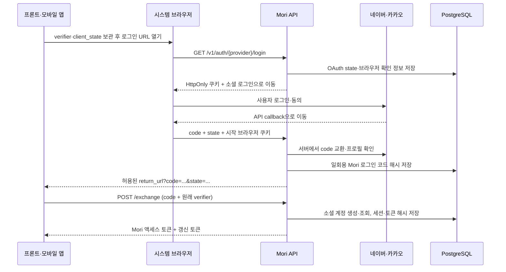

# 네이버·카카오 소셜 가입·로그인

Mori는 네이버 또는 카카오 인증을 완료해야 가입할 수 있다. 별도 회원가입 API, 비밀번호 로그인, 개발용 인증 우회, 운영자의 사용자·토큰 발급 명령은 제공하지 않는다. 첫 로그인은 계정을 만들고 이후 로그인은 같은 Mori 계정을 사용한다.

## 전체 흐름



OAuth `state`와 브라우저 쿠키는 서버가 생성하며 10분 동안 유효하다. 클라이언트가 생성한 `client_state`는 복귀 대상 앱이 요청의 일치 여부를 확인하는 값이다. Mori 교환 코드는 2분 동안 유효하고 한 번만 사용할 수 있다.

S256 검증은 **Mori가 앱에 전달하는 교환 코드**를 원래 클라이언트에 묶는다. 네이버·카카오의 OAuth API에 PKCE 지원을 가정해서 보내는 구현이 아니다. 제공자 인증은 서버의 Client Secret과 등록한 API 콜백을 사용한다.

## 환경 설정

| 환경 변수 | 용도·기본값 |
| --- | --- |
| `MORI_AUTH_PUBLIC_BASE_URL` | 외부에서 접근할 API origin. 기본 `http://localhost:8000`; 경로 접두사 없음 |
| `MORI_AUTH_RETURN_URLS` | 프론트·앱 복귀 주소의 JSON 배열. 기본 `["http://localhost:5173/auth/callback"]` |
| `MORI_CORS_ORIGINS` | 코드 교환·API 요청을 보낼 프론트 origin 배열. 기본 `[]` |
| `MORI_AUTH_COOKIE_SECURE` | 기본 `true`; localhost HTTP 개발에서만 `false` 허용 |
| `MORI_NAVER_CLIENT_ID`, `MORI_NAVER_CLIENT_SECRET` | 네이버 애플리케이션 Client ID·Secret |
| `MORI_KAKAO_CLIENT_ID`, `MORI_KAKAO_CLIENT_SECRET` | 카카오 REST API 키·활성화한 Client Secret |
| `MORI_AUTH_ACCESS_TOKEN_SECONDS` | 액세스 토큰 수명, 기본 900초; 60~3,600초 |
| `MORI_AUTH_SESSION_DAYS` | 로그인 세션 최대 수명, 기본 30일; 1~90일 |

복귀 주소는 문자열 전체가 허용 목록과 일치해야 한다. HTTPS, localhost HTTP, 명시적으로 등록한 `mori://auth/callback` 같은 앱 주소를 지원한다. 쿼리·fragment·사용자 자격 증명이 포함된 주소는 설정할 수 없다. 운영 URL과 프론트 주소가 정해지면 예시 값을 교체한다.

### 네이버 개발자 콘솔

네이버 로그인 애플리케이션의 서비스 URL과 Callback URL을 등록하고 Client ID·Secret을 서버에 설정한다. Callback URL은 프론트 주소가 아닌 `${MORI_AUTH_PUBLIC_BASE_URL}/v1/auth/naver/callback`이다. 예: `http://localhost:8000/v1/auth/naver/callback`.

서버는 인가 코드를 POST로 교환한 뒤 `/v1/nid/me`에서 계정 식별자를 확인한다. 닉네임은 선택 정보로 취급하고, 없으면 `모리 사용자`를 사용한다. 이메일·전화번호 동의를 가입 조건으로 삼지 않는다. [네이버 로그인 API](https://developers.naver.com/docs/login/api/api.md), [프로필 조회 API](https://developers.naver.com/docs/login/profile/profile.md).

### 카카오 개발자 콘솔

카카오 로그인을 활성화하고 Redirect URI를 `${MORI_AUTH_PUBLIC_BASE_URL}/v1/auth/kakao/callback`으로 등록한다. 예: `http://localhost:8000/v1/auth/kakao/callback`. REST API 키를 `MORI_KAKAO_CLIENT_ID`에 넣는다. 이 서버 구현은 Client Secret도 필수로 받으므로 콘솔에서 활성화하고 함께 설정한다.

서버는 인가 코드를 교환한 뒤 `/v2/user/me`의 `id`와 선택적인 `kakao_account.profile.nickname`을 읽는다. 필요한 동의 항목만 구성하고 이메일은 필수로 요청하지 않는다. 개발 중 접근 가능한 계정과 외부 사용자 공개 조건은 애플리케이션의 콘솔 상태에 맞춰 확인한다. [카카오 로그인 REST API](https://developers.kakao.com/docs/ko/kakaologin/rest-api).

키를 설정하지 않은 제공자는 로그인 시작을 거부한다. `/providers`의 `enabled`는 설정 유무이며 제공자 접속 상태나 실제 키 유효성을 검증한 결과가 아니다.

## API 계약

### 로그인 시작

`GET /v1/auth/{provider}/login`, `provider`는 `naver` 또는 `kakao`다.

| 쿼리 | 규칙 |
| --- | --- |
| `return_url` | 서버 허용 목록에 등록한 복귀 주소 |
| `code_challenge` | 원래 verifier를 SHA-256 후 base64url 인코딩한 43자, padding 제외 |
| `client_state` | 클라이언트가 만든 32~128자 난수, `[A-Za-z0-9_-]` |

브라우저를 이 URL로 이동시키면 서버가 쿠키를 설정하고 제공자 화면으로 `302` 이동한다. fetch로 먼저 호출한 다음 다른 브라우저로 옮기지 않는다. 콜백이 로그인을 시작한 브라우저의 쿠키를 가져야 한다.

`GET /v1/auth/{provider}/callback`은 제공자 전용 콜백이다. 앱이 제공자 code나 프로필을 만들어 직접 가입하는 용도로 사용하지 않는다. 성공하면 등록한 복귀 주소로 `?code=<Mori 일회용 코드>&state=<client_state>`를 붙여 이동한다. 제공자 토큰이나 Mori 액세스·갱신 토큰은 URL에 넣지 않는다.

### 코드 교환

`POST /v1/auth/exchange`, JSON:

```json
{
  "code": "복귀 주소에서 받은 43자 Mori 코드",
  "code_verifier": "로그인 시작 전에 보관한 43~128자 verifier"
}
```

`code_verifier`는 `[A-Za-z0-9._~-]` 문자만 허용한다. 위 JSON은 설명용이며 실제 난수를 넣어야 한다. 성공 응답은 다음 형태다.

```json
{
  "access_token": "mori_at_...",
  "token_type": "Bearer",
  "expires_in": 900,
  "refresh_token": "mori_rt_...",
  "refresh_expires_in": 2592000
}
```

코드 교환에 성공한 뒤 DB commit과 함께 가입이 확정된다. 다른 사용자의 ID·이메일·닉네임을 요청에 넣어 가입할 수 없다. 같은 제공자의 같은 식별자는 동시에 가입해도 하나의 사용자만 생성한다.

### 갱신·로그아웃·내 정보

| 요청 | 인증·본문 | 결과 |
| --- | --- | --- |
| `GET /v1/auth/providers` | 없음 | `[{"provider":"naver","enabled":true}, ...]` |
| `POST /v1/auth/refresh` | `{"refresh_token":"mori_rt_..."}` | 새 토큰 쌍; 기존 갱신 토큰 사용 완료 처리 |
| `POST /v1/auth/logout` | Mori Bearer 액세스 토큰 | 현재 기기 세션 폐기, `204` |
| `GET /v1/me` | Mori Bearer 액세스 토큰 | `{"id":"UUID","display_name":"이름","providers":["naver"]}` |

기존 액세스 토큰은 갱신 후에도 자신의 만료 시각까지 유효하다. 세션이 폐기되면 그 세션의 모든 액세스·갱신 토큰이 즉시 인증에 실패한다. 갱신해도 로그인 시 정한 세션 종료 시각은 늘어나지 않는다. 다른 기기 세션은 유지한다. 로그아웃은 Mori 세션 종료이며 소셜 제공자 로그아웃·연결 해제·회원 탈퇴를 수행하지 않는다.

## 프론트 연결 예시

아래는 브라우저의 동일 탭 리다이렉트 예시다. 서버 주소와 복귀 주소를 실제 값으로 설정한다. 프론트 UI는 별도 구현한다.

```javascript
const api = 'http://localhost:8000';
const returnUrl = 'http://localhost:5173/auth/callback';
const base64url = bytes => btoa(String.fromCharCode(...bytes))
  .replaceAll('+', '-').replaceAll('/', '_').replaceAll('=', '');
const random = () => base64url(crypto.getRandomValues(new Uint8Array(32)));

async function startSocialLogin(provider) {
  const verifier = random();
  const state = random();
  const digest = await crypto.subtle.digest('SHA-256', new TextEncoder().encode(verifier));
  sessionStorage.setItem('mori.login', JSON.stringify({ verifier, state }));
  const url = new URL(`/v1/auth/${provider}/login`, api);
  url.search = new URLSearchParams({
    return_url: returnUrl,
    code_challenge: base64url(new Uint8Array(digest)),
    client_state: state,
  }).toString();
  location.assign(url);
}

async function finishSocialLogin() {
  const query = new URLSearchParams(location.search);
  const saved = JSON.parse(sessionStorage.getItem('mori.login') || 'null');
  // 분석 스크립트·외부 리소스를 로드하기 전에 콜백 URL을 비운다.
  history.replaceState(null, '', location.pathname);
  if (!saved || query.get('state') !== saved.state) throw new Error('로그인 요청 불일치');
  sessionStorage.removeItem('mori.login');
  if (query.has('error') || !query.has('code')) throw new Error('다시 로그인해 주세요');
  const response = await fetch(`${api}/v1/auth/exchange`, {
    method: 'POST',
    headers: { 'Content-Type': 'application/json' },
    body: JSON.stringify({ code: query.get('code'), code_verifier: saved.verifier }),
  });
  if (!response.ok) throw new Error('다시 로그인해 주세요');
  return response.json(); // 토큰을 로그나 URL에 출력하지 않는다.
}
```

액세스 토큰은 `Authorization: Bearer ...`로 주차 API와 `/v1/me`에 사용한다. 갱신 호출은 앱 전체에서 한 번만 진행하고 새 토큰 쌍을 함께 교체한다. 중복 갱신이나 이전 갱신 토큰 재전송은 해당 세션을 종료시킨다. 코드 교환·갱신 응답이 유실되어 유효한 토큰을 확정할 수 없으면 다시 로그인한다.

브라우저 예시는 로그인 중 verifier만 sessionStorage에 보관한다. 웹의 장기 로그인 저장 방식은 프론트 통합 시 결정해야 한다. 현재 API는 JSON Bearer 계약이며 HttpOnly 갱신 쿠키를 제공하지 않는다. 우선 토큰을 메모리에 보관하거나 별도 BFF 세션을 사용하고, 장기 갱신 토큰을 localStorage에 상시 저장하는 방식은 피한다.

모바일 앱에서는 verifier와 토큰을 Keychain·Keystore 기반 저장소에 보관한다. 시스템 인증 브라우저에서 **Mori 로그인 시작 URL**을 열고, 등록한 앱 복귀 링크에서 state를 확인한 다음 코드 교환을 수행한다. 앱의 네이티브 로그인 SDK가 발급한 토큰을 직접 받는 별도 서버 API는 없다. 앱 링크 등록과 브라우저 복귀는 네이티브 연동 시 검증한다.

## 오류와 계정 정책

| 상황 | 처리 |
| --- | --- |
| 잘못된 복귀 주소 | `400 INVALID_RETURN_URL` |
| 만료·재사용 state 또는 시작 브라우저 쿠키 불일치 | `400 INVALID_OAUTH_STATE`; 새 로그인 |
| 사용자가 동의를 취소하거나 code가 없음 | 허용된 복귀 주소에 `error=oauth_denied` |
| 제공자 통신·인증·프로필 확인 실패 | 허용된 복귀 주소에 `error=oauth_failed`; 새 로그인 |
| 만료·재사용 교환 코드 또는 verifier 불일치 | `401 INVALID_LOGIN_CODE` |
| 유효하지 않거나 만료된 갱신 토큰·세션 | `401 INVALID_REFRESH_TOKEN` |
| 이미 사용한 갱신 토큰 재사용 | `401 REFRESH_TOKEN_REUSED`; 세션 폐기 후 새 로그인 |
| 설정 누락 | `503 SOCIAL_LOGIN_NOT_CONFIGURED` |
| JSON·파라미터 형식 오류 | `422 VALIDATION_ERROR` |
| DB 장애 | `503 DATABASE_UNAVAILABLE` 또는 `RETRY_REQUEST` |

기존 네이버 계정으로 가입한 사람이 카카오로 로그인하면 별도 Mori 계정이 생성된다. 이메일이 같다는 이유로 주차 기록이나 계정을 합치지 않는다. 두 제공자를 하나의 계정에 연결하는 추가 기능은 제공하지 않는다.

현재 검증은 제공자 HTTP를 모의 응답으로 대체한 PostgreSQL 통합 테스트까지다. 실제 키를 설정한 뒤 두 제공자 각각 최초 가입·재로그인·취소·갱신·로그아웃을 실제 브라우저에서 확인해야 한다.
