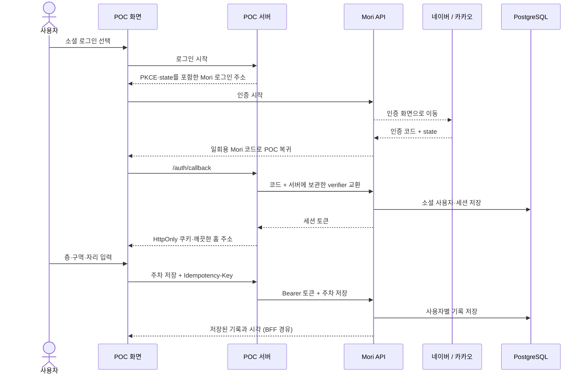

# 앱 POC 개편 — 2026-09-17

## 디자인 방향

App Store의 ‘오늘’처럼 한 장의 큰 카드가 화면의 시작점을 만듭니다. 기능을 늘어놓는 대시보드 대신 현재 필요한 기억과 바로 할 수 있는 일을 보여줍니다. 마스코트의 기존 형태와 색을 유지하고, 부드러운 세이지·크림 색상에 파란 주차 아이콘, 코랄 일정 아이콘, 보라색 부탁 아이콘을 더했습니다.

- 오늘: 날짜·큰 제목, 시간대별 모리 카드, 세 가지 실행, 마지막 주차, 오늘 일정, 여행·문서 제안.
- 대화: 생활·여행·문서 그룹과 대화 목록. 입력창에서 글·마이크를 오가며 파일 이름을 첨부.
- 캘린더: 월간 달력과 선택 날짜의 일정. 직접 추가·수정·삭제하며 채팅으로 이동하지 않음.
- 기억: 마지막 주차를 먼저 표시하고 작은 기억을 카드로 보관.
- 공통: 네 개의 하단 탭, 별도 마이크, 계정 아바타, 하단 시트, 저장 성공 연출.

폰트는 로컬 Pretendard와 시스템 폰트를 사용합니다. 제목·본문·보조문구의 크기와 자간을 나누고, 카드 사이 여백과 터치 영역을 확보했습니다. 마스코트 부유, 페이지 등장, 버튼 눌림, 시트 전환, 음성 파형, 저장 완료 효과를 적용했으며 `prefers-reduced-motion`에서는 움직임을 줄입니다.

참고한 공식 자료: [Apple App Store](https://www.apple.com/app-store/), [Apple Tab bars](https://developer.apple.com/design/human-interface-guidelines/tab-bars), [당근 SEED](https://seed-design.io/), [토스의 가치 전달 원칙](https://toss.tech/article/value-first-cost-later). ChatGPT에서 익숙한 글·음성 입력 전환은 모리의 대화 화면에 맞게 구성했습니다.

## 실제 로그인·주차 연결

공급자 토큰과 Mori 토큰을 화면·localStorage에 저장하지 않습니다. POC 서버는 허용된 API 경로만 중계하며, Host와 변경 요청의 Origin을 확인합니다. 로그인 흐름은 쿠키·state·PKCE에 묶이고 만료·취소·재사용 시 재로그인을 안내합니다. 동시에 들어온 요청은 토큰 갱신 하나를 공유하며, 갱신 결과가 불확실하면 같은 refresh token을 재사용하지 않습니다.

주차 저장은 성공 응답을 받은 뒤에만 완료 화면을 표시합니다. 통신 실패 후 같은 입력을 재시도하면 동일한 중복 방지 키를 사용합니다. 로그아웃·계정 전환 시 화면의 주차 기록과 저장 초안을 비우며, 늦게 도착한 이전 계정의 응답을 반영하지 않습니다.

평일 06–10시의 주차 강조는 POC의 명시적 시간대 규칙입니다. Hermes가 습관을 학습했거나 휴대폰 위젯을 등록했다고 표현하지 않습니다.

## 검증 기록

- Node 테스트 27개: 기존 순수 모델 12개, 새 UI 모델 4개, 실제 HTTP 요청을 사용하는 POC 서버 11개.
- 서버 테스트: 두 소셜 공급자, PKCE·쿠키·state, 취소·변조, Origin/Host 제한, 임의 파일/API 경로 차단, 사용자별 주차, 중복 방지 키 전달, 동시 갱신, 갱신 실패·로그아웃, HTTPS 쿠키.
- 별도 임시 PostgreSQL DB와 실제 `master` API로 브라우저 통합 확인. 외부 네이버·카카오의 인증 응답만 모의 제공자로 대체. 실제 공급자 키를 사용하는 라이브 로그인은 미검증.
- 네이버 가입 → 주차 저장 → 성공 연출 → 새로고침 후 조회 → 로그아웃 → 카카오 가입 후 이전 주차 미노출 확인.
- 반응형 화면: 320×720, 390×844, 768×1024, 844×390에서 확인. 좁은 화면과 가로 화면의 네 탭 모두 가로 넘침 없음. 실제 iOS 키보드·안전 영역·마이크 권한은 기기 검증이 필요함.
- 직접 일정 추가, 음성 예시 → 채팅 → 주차 확인 폼, 대화 그룹 이동과 기기 내 기록 확인.

테스트용 소셜 응답은 별도 테스트 프로세스에서만 사용했으며 POC 서버와 제품 API에 우회 로그인 기능을 추가하지 않았습니다.
