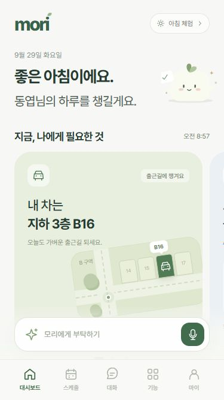

# 기능 기반 앱 PoC — 2026-09-29

기준: plan 브랜치 `product/feature-dashboard-scenario-2026-09-29.md`. 앱 화면 체험과 실제 Hermes 운영 상태를 구분합니다.

## 화면

세이지·크림, 큰 제목, 여백, 얇은 아이콘, 5개 탭, 카드 캐러셀과 하단 시트. 로컬 Pretendard와 기존 모리 마스코트를 유지합니다. 음성은 진행 중인 대화로 이어집니다. OS의 움직임 줄이기를 지원합니다.

## 시나리오

| 시나리오 | 체험 방법 | 결과 |
| --- | --- | --- |
| 주차 | 대화에 지하 3층 B16에 주차했어 → 결과 → 새 위치 | 최신 위치로 교체, 설정한 출근 전 간격에 카드 표시, 중지/재개, 푸시와 별도 |
| 뉴스 | 하루 미리보기 브리핑 09:00 / 기능 뉴스 | 수집 중→완료, 기준 시각·예시 출처, 실패→재시도 |
| 주가 | 기능→관심 주가→종목/기간 선택 | 그래프·라벨·통화 변경, 예시 시세 |
| 메모 | 우산 챙기기 메모해줘 / 직접 제목만 입력 | 대시보드 기록과 같은 메모, 편집/삭제 |
| 스케줄 | 내일 오후 2시 디자인 미팅 일정 추가해줘 | 월/주/일과 같은 일정, 직접 CRUD |
| 알림 | 음성 예시 30분 뒤 알림→대화로 이어가기 | 현재 대화에서만 상세 자동 열기, 초 단위 카운트다운, +5분/취소 |
| 커스텀 | 가이드 마지막 예시→결과→지금 실행 | 정의·버전, 오늘 메모 체크리스트, 편집/중지/재개 |
| 시간 없는 기능 | 시간 없이 저장 후 실행 | 대시보드 기록과 정리에 결과 표시 |
| 문서 | 문서 정리→예시 또는 TXT/MD/CSV | 실제 내용 읽기, 번호 목록+원문 TXT 생성 및 다운로드 요청 |
| 대화 유지 | 텍스트→음성 예시→수정→전송 | 같은 대화에 추가, 검색, 새로고침 후 복원 |
| 마이 | 로그인·사용자 정보·이름 수정·테마·요금제 | 계정 API 연결, 테마 저장, 결제 준비 상태 안내 |

커스텀의 이름·설명·시간·참고 내용·작업은 선택적으로 입력합니다. 작업 없는 정의는 초안이며 실행을 비활성화합니다. 공통 상세 템플릿을 사용하고 임의 UI 코드를 생성하지 않습니다. 일반 인사는 기능을 만들지 않습니다.

## 실행 모델

- 하나의 로컬 상태를 화면/대화/결과에서 공유하며 `mori.experience.v6`에 보관합니다.
- 체험 시각은 실제 경과 시간에 따라 흐르고 미리보기로 이동합니다. 시간 이동은 기록을 지우지 않습니다.
- 알림은 목표 timestamp를 저장합니다. 다른 대화나 화면으로 이동한 뒤에는 상세를 자동으로 열지 않습니다.
- 예약은 날짜+시간으로 중복을 막고 평일/1회를 구분합니다. 앱이 닫힌 동안 실제 실행을 보장하지 않습니다. 재접속 시 당일 미실행 항목을 보정합니다.
- 응답 대기 중 대화를 바꿔도 원래 대화에 기록합니다. 초기화 후에는 이전 응답을 버립니다.
- 커스텀 실행은 오늘 저장한 메모 제목을 체크리스트로 만드는 예시입니다. 임의 작업의 실제 AI 실행은 연결 전입니다.
- 뉴스와 주가는 예시 표시를 유지합니다. 기사 상세 출처도 예시입니다.
- 실제 계정은 기존 BFF를 사용합니다. 최신 주차 GET은 `/api/parking/latest`, 저장은 `/api/parking`와 idempotency key입니다.

## 검증

- build/check/test 통과, 36개 테스트.
- 새 테스트: 일반 대화의 기능 미생성, 최신 주차와 카드 표시 간격/중지, 현재 카드, 알림 시각 유지, 메모/일정 요청, 커스텀 중복 방지/중지, 예약 중복 방지/뉴스 상태 전이.
- 브라우저: 주차→메모→음성 예시→알림을 같은 대화로 실행, +5분/취소 확인.
- 커스텀 생성/실행/중지/편집과 버전 변경, 새로고침 후 기록 유지 확인.
- 대화 및 직접 일정 저장, 주간/일간 전환 확인.
- 뉴스 실패/재수집/완료, 애플 USD와 주간 그래프 전환 확인.
- 실제 문서 내용/원문 결과 생성 및 다운로드 요청 확인. 인앱 브라우저의 다운로드 이벤트 대기가 시간 초과하여 OS 파일 저장 완료는 검증하지 못했습니다.
- 390×844 폰 세로, 844×390 폰 가로, 768×1024 태블릿 세로, 1024×768 태블릿 가로 확인. 페이지 가로 넘침 없음. 검증 중 콘솔 오류 없음.
- 작은 폰 기준으로 320×568 세로, 375×667 세로, 568×320 가로를 다시 확인. 5개 탭, 대화창, 음성 입력, 주차·뉴스·알림·문서·커스텀 상세, 하루 미리보기, 일정 입력, 요금제 선택에서 가로 넘침과 버튼 접근성을 확인했습니다.
- 320px 폭에서 하루 미리보기 카드의 글자 쪼개짐, 일정 날짜·시간 입력의 가로 넘침, 주차 지도와 위치 번호의 겹침, 요금제 카드 줄바꿈을 수정했습니다. 작은 폰 높이에서는 음성 전송 버튼이 보이게 조정했고, 가로 화면에는 음성 입력을 두 열로 배치했습니다.
- 대시보드 외 탭의 과도한 하단 빈 공간과 대화 목록 마스코트 잘림을 줄였습니다. 화면 갱신 시 현재 스크롤과 카드 위치를 보존합니다. 위 미리보기 이미지는 375×667 모바일 화면입니다.
- 실제 마이크 녹음, 소셜 실계정, GPU/Hermes, OS 푸시, Excel/PDF 처리는 이번 UI 검증 범위 밖입니다.

## 2026-09-30 UI/UX 정리

- 캘린더의 월·주·일 화면을 구분했습니다. 월은 날짜 선택과 선택일의 일정 카드, 주는 날짜별 묶음, 일은 시간대별 목록입니다. 800px 이상 월 보기에서는 달력과 일정 목록을 나란히 보여줍니다.
- 일정 종류(일·업무 / 약속 / 나의 시간)별 색상, 오늘 표시, 다음 일정, 날짜별 일정 개수, 연도·월 바로 이동을 제공합니다. 날짜 키보드는 방향키, Home/End, PageUp/PageDown을 지원합니다.
- 일정 폼에 소요 시간·종류·메모를 추가했습니다. 기존 데이터에는 기본 60분을 적용하며, 저장 전 종료 시각과 겹치는 약속을 안내합니다. 새벽·야간 일정 및 다음 날까지 이어지는 일정을 누락하지 않습니다. 삭제 후 9초 동안 되돌릴 수 있습니다.
- 기본 select를 공통 선택 필드로 교체했습니다. 반복, 주차 카드 표시 간격, 일정 종류·소요 시간은 동일한 선택 상태와 목록을 사용합니다. 방향키·Enter·Escape·Tab, 목록 밖 클릭을 지원하고 폼 스크롤 안에서 열려 작은 화면에서도 잘리지 않습니다.
- 섹션 간격, 카드 안쪽 여백, 입력 높이, 모서리 반경을 정리했습니다. 작은 보조 글자의 크기와 대비를 높이고, 일정 목록 등장·카드 호버·선택 상태에 전환 효과를 적용했습니다. 기존 움직임 줄이기 설정을 따릅니다.
- 날짜 계산은 `src/calendar-model.mjs`, 공통 선택 UI는 `src/choice-field.mjs`에서 관리합니다. HTML / JavaScript / SCSS 구성과 기존 실제 계정·주차 API 경로는 유지합니다.
- 이 변경은 PoC의 로컬 화면·데이터 동작입니다. Hermes 채팅, 실제 캘린더 API, 서버 예약·푸시 연결을 추가한 것은 아닙니다.

검증: SCSS 빌드, JavaScript 구문 검사, 테스트 41개(달력 날짜 경계·누락·시간 겹침 포함). 브라우저에서 일정 생성/편집/새로고침 후 유지, 선택 필드 키보드 조작, 자정 이후 표시, 삭제/되돌리기를 확인했습니다.

## 2026-09-30 스케줄 외 영역 고도화

- **대시보드:** 메모 버튼은 직접 작성 폼을 엽니다. 메모·문서·내 기능의 실행 결과를 최근 순서로 합쳐 3개만 보여주고, 전체 기록은 종류별 필터가 있는 보관함에서 확인합니다. 주차 그림의 가상 구역/자리 번호를 제거하고 위치 메모임을 구분했습니다. 내 기능의 카드는 저녁에 한정된 표현 대신 요청과 결과 상태를 보여줍니다. 뉴스 카드는 관심 주제와 준비 상태를 반영합니다.
- **대화:** 고정/오늘/어제/이전 대화로 묶고 제목과 본문을 검색합니다. 검색 결과가 없는 상태를 별도로 안내합니다. 대화 상단의 정리 버튼에서 이름 변경과 고정/해제를 지원합니다. 새로운 대화와 각 기존 대화의 초안을 따로 보관하고 새로고침 뒤에도 복원합니다. 예시 요청은 바로 실행하지 않고 입력란에 채워 확인 후 전송하도록 했습니다. 결과 링크를 구별되는 카드로 표현하고 읽고 있는 중에는 새 응답으로 스크롤을 강제로 내리지 않습니다.
- **음성:** 음성 창을 오가도 키보드 초안을 유지합니다. `채팅에 담기`는 기존 문장 뒤에 음성 내용을 붙이며, 사용자가 확인 후 보냅니다. 합산 4,000자 제한과 빈 메시지 전송 방지를 적용했습니다. 음성 오브·녹음 상태·버튼 대비를 정돈했습니다. 실제 마이크 권한과 음성 인식은 브라우저 환경에 따라 다르며 검증에서는 음성 예시를 사용했습니다.
- **기능:** 기본 카드에 현재 주차·메모 개수·브리핑 시간·관심 종목·알림 개수를 표시합니다. 내 기능에 사용 상태와 최근 결과를 표시하며, 만들기/편집 폼은 카드 미리보기, 6개 기본 아이콘, 선택형 참고 자료를 제공합니다. 미리보기와 저장 시 시간/반복의 기본값은 같습니다. 온라인 아이콘 검색과 실제 스킬 생성은 구현 범위가 아닙니다.
- **상세 화면:** 뉴스 상태 전환과 알림 완료 시뮬레이션을 접힌 체험 옵션으로 옮겼습니다. 메모 삭제 후 되돌리기, 문서의 정리 목록/원문 펼치기, 주차 긴 위치명 줄바꿈을 보완했습니다. 새 문서는 원문 앞부분을 목록으로 옮기는 로컬 처리이며 실제 AI 요약으로 표시하지 않습니다. 기존 형식으로 저장된 문서는 그대로 열립니다.
- **마이:** 프로필·기록/대화/기능 개수·플랜 체험·개인 설정·실제 계정 연결을 구분했습니다. 설정마다 적용 범위를 설명하고 초기화는 기록 관리 하위에 배치했습니다. Free/Pro 표시는 체험이며 실제 계정 권한이나 결제 상태를 바꾸지 않습니다.
- 카드·입력·버튼 간격, 작은 글자 대비, 빈 상태, 키보드 포커스와 전환 애니메이션을 정리했습니다. 기존 움직임 줄이기 설정을 따릅니다. 스케줄 모델과 월·주·일 화면의 동작은 이번 추가 작업에서 변경하지 않았습니다.

검증: 구문 검사와 44개 테스트 통과(통합 기록 정렬/필터, 고정 대화 및 월말 날짜 그룹, 미리보기 기본값 포함). 별도 로컬 포트에서 메모 저장/삭제/복원, 문서 정리/원문, 기능 아이콘 저장/실행/보관함 연결, 뉴스 실패/재시도, 채팅 초안 복원과 음성 전환을 확인했습니다. 이 변경은 HTML/JavaScript/SCSS PoC이며 실제 Hermes·검색·푸시·소셜 로그인 서버 통합 검증을 의미하지 않습니다.

## 2026-09-30 대시보드 시간 범위 탐색

- `지금, 나에게 필요한 것` 우측 시간 버튼으로 **지금 / 3시간 / 5시간 / 하루**를 선택합니다. 하루는 오늘 자정까지가 아니라 **현재부터 24시간**입니다. 선택은 탭 이동 중 유지되며 새로고침 시 `지금`으로 돌아옵니다.
- `지금`은 기존 현재 카드 캐러셀을 유지합니다. 범위를 넓히면 **지금 확인할 카드 → 오늘 아침/오후/저녁 → 내일 새벽/아침**처럼 해당 범위에 실제 항목이 있는 시간대별 가로 목록을 만듭니다. 터치 스크롤, 좌우 버튼, 카드의 방향키/Home/End 탐색을 지원합니다.
- 주차/주가의 카드 표시 시각, 뉴스 수집 시작, 개별 약속, 알림 목표 시각, 내 기능의 실행 시각을 구분해 표시합니다. 카드에는 시각·현재/예정 상태·기능명·설명이 있고, 선택하면 기존 상세 화면을 엽니다. 미래에 실행될 결과를 미리 생성하거나 성공한 것처럼 표시하지 않습니다.
- 미리보기 계산은 `src/dashboard-timeline.mjs`에서 순수하게 수행합니다. 체험 시간을 바꾸거나 예약 실행·데이터 저장을 호출하지 않습니다. 시간 범위는 시작을 포함하고 끝 시각은 제외합니다. 이미 표시 중인 카드는 `지금 확인` 묶음에 포함됩니다.
- 날짜 경계, 종료된 약속, 다음 날 반복, 평일 반복, 중지/취소/실행 완료된 한 번 예약, 시간이 없는 기능을 구분합니다. 주차/뉴스/주가의 반복 정책은 기존 PoC 정의를 따릅니다. 실제 서버 스케줄 조회는 추가하지 않았습니다.
- 작은 화면에서 펼침 메뉴가 하단 입력창에 가려지면 화면 안쪽으로 옮겨 표시합니다. Escape·바깥 클릭·키보드 선택, 가로 목록 위치 유지, 움직임 줄이기 설정을 지원합니다.

검증: 전체 테스트 50개 통과. 3/5/24시간 포함 범위, 자정과 월말, 실행 없는 읽기 계산, 반복 중복 방지, 취소/중지 및 1회 예약을 검사했습니다. 브라우저에서 범위 전환·가로 넘김·키보드·모바일 메뉴 표시를 확인했습니다.

## 2026-09-30 마이 · 계정 설정 정리

- 마이는 로그인·로그아웃, 사용자 정보 조회·이름 수정, 시스템/라이트/다크 테마, 요금제·결제 관리로 정리했습니다. 위의 초기 마이 검증 기록은 이전 화면이며 현재는 출근 시간, 대시보드 토글, 기록 수, 체험 시간, 기록 초기화, 가짜 Free/Pro 전환을 마이에서 제공하지 않습니다.
- 로그인한 계정의 이름·테마는 실제 API에 저장합니다. 동시에 수정하면 revision 충돌을 안내합니다. 테마는 로그인 전에는 브라우저에만 저장되며, 움직임 줄이기는 OS 설정을 따릅니다.
- 로그인·로그아웃은 기존 네이버/카카오 인증을 사용하고, 토큰은 서버 세션에만 보관합니다. 소셜 키가 없는 공급자는 로그인 버튼을 비활성화합니다.
- 무료 이용은 결제가 필요 없습니다. Pro 결제·해지는 결제사, 가격, 주기가 확정되지 않아 준비 중이며 결제 성공을 흉내 내지 않습니다. 기존 관리자 승인 Pro는 결제 구독과 구분합니다.
- 백엔드는 `GET/PATCH /v1/me`, `GET/PUT /v1/me/settings`, `GET /v1/plans`, `GET /v1/me/subscription`을 사용합니다. `/me/preferences`, `/me/summary`는 제거했습니다. `0006_account_settings` 적용이 필요합니다.
- 다른 탭의 대화·일정·기록 등은 기존 로컬 PoC 데이터이며 이번 변경이 전체 기능의 서버 연동을 의미하지 않습니다.

검증: PoC 테스트 51개, 백엔드 테스트 185개 통과. 인증·소유권·수정 충돌, 허용된 BFF 경로와 요청 출처 검증을 확인했습니다. 브라우저에서는 마이 화면, 모바일 배치, 테마 전환·새로고침 유지, 결제 준비 상태를 확인했습니다. 실제 소셜 로그인은 공급자 키와 콜백 설정 후 확인해야 합니다.

## 2026-10-02 주차·문서 UI 보완

- 백엔드 0.7.0에 맞춰 주차 용도(출근용/외부)와 표시 방식(상시/정한 시간)을 선택하는 폼을 추가했습니다. 지정 시간일 때만 시각·요일·표시 기간을 펼치며 저장할 위치와 표시 방식을 미리 보여줍니다.
- 단순 위치 기억은 상시 표시하고, 출근 표시 요청은 기존 체험 문맥을 사용합니다. 상시 카드는 하루 범위에서도 하나만 표시합니다. 주차 일시중지 버튼은 제거했고 기존 기록은 초기화하지 않습니다.
- 문서는 UTF-8 10,000,000바이트까지 지원하며 IndexedDB에 원문 하나를 보관합니다. 목록에는 메타데이터만 저장하고 상세 미리보기는 12,000자로 제한합니다. 파일명·용량·원문 보관 상태와 원문 다운로드 버튼을 제공합니다. 기존 문서 형식도 읽습니다.
- 320×568, 375×667 모바일에서 주차 선택과 문서 상세 배치를 확인했고 가로 넘침이 없었습니다. 320px의 시간 입력은 한 열로 배치했습니다. 실제 10MB 파일을 선택해 저장하고 새로고침 후 원문 앞부분과 용량을 다시 확인했습니다.
- 구문 검사·CSS 빌드·자동 테스트 56개 통과. 브라우저 다운로드 완료 이벤트는 확인하지 못했으며 다운로드 버튼/원문 읽기 경로와 기존 파일 복원은 검증했습니다.
- 로컬 PoC 경험의 변경입니다. 운영 서버 배포·전체 화면 API 연결·실제 Hermes/GPU·기기 푸시·Office 변환은 수행하지 않았습니다.
