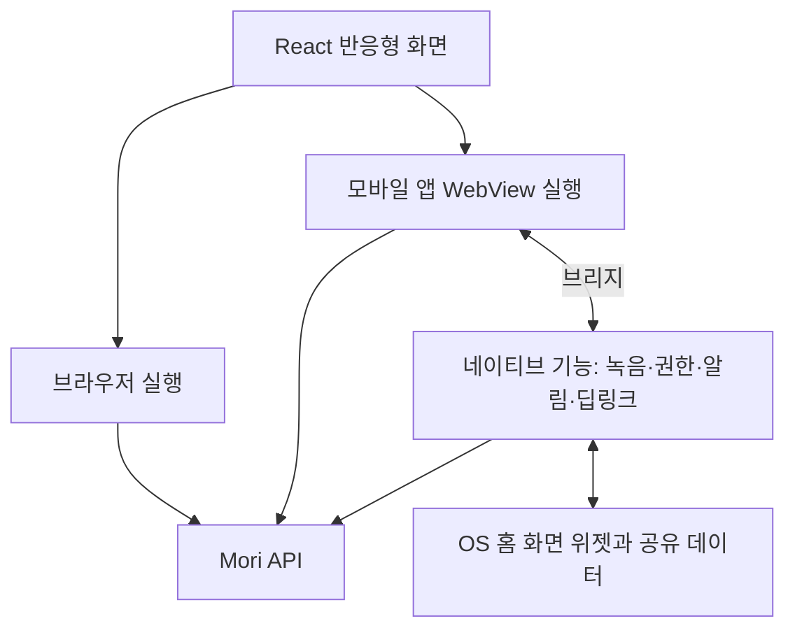

# Front — 사용자 경험·화면 설계

[전체 계획으로 돌아가기](../plan.md)

실제 서비스 프론트엔드와 모바일 앱·위젯 구현은 사용자가 담당한다. AI는 사용자가 요청한 범위의 `poc` 화면과 API 계약·예시 데이터를 준비한다. **초기 실제 제품은 React 기반 반응형 웹으로 개발하고, 이후 모바일 앱의 WebView에서도 같은 React 화면을 재사용한다.** 녹음·권한·알림·위젯 등 기기 기능은 네이티브 계층으로 연결한다. 이 하이브리드 구조는 사용자와 정한 방향이며, 앱 컨테이너 기술은 아직 확정하지 않았다.

## 1. 화면의 기본 원칙

- 첫 화면에서 오늘 필요한 정보와 바로 실행할 수 있는 버튼이 보인다.
- 큰 버튼과 짧고 구체적인 문구를 사용한다. ‘에이전트’, ‘스킬’, ‘Pod’ 같은 내부 용어를 주요 사용 흐름에 노출하지 않는다.
- 대화 입력을 잘하지 못해도 ‘주차 기억하기’, ‘일정 추가’로 시작할 수 있다.
- 행동 뒤에는 “지하 3층 B12, 기억했어요”, “토요일 오후 6시 일정을 등록했어요”처럼 결과를 알려준다.
- 음성 인식이 잘못되면 다시 처음부터 말하지 않고 텍스트나 선택 버튼으로 고칠 수 있다.
- 자주 쓰는 기능이 눈에 잘 띄되, 매번 화면의 모든 버튼 위치가 바뀌지는 않는다.
- 글자 확대, 스크린리더, 충분한 터치 영역과 대비를 고려한다. 색상·아이콘만으로 의미를 전달하지 않는다.

## 2. 첫 화면: 오늘 대시보드

```text
┌──────────────────────────────────┐
│ 좋은 아침이에요             내 설정 │
│ 오늘 9월 16일 수요일              │
│                                  │
│ [ 마이크로 말하기 ]               │
│                                  │
│ 지금 필요한 정보                  │
│ ┌──────────────────────────────┐ │
│ │ 내 차: 지하 3층 B12           │ │
│ │ 어제 오후 8:42에 기억했어요   │ │
│ │ [위치 수정] [이제 필요 없어요]│ │
│ └──────────────────────────────┘ │
│ ┌──────────────────────────────┐ │
│ │ 오늘 오후 6시 · 민수와 저녁   │ │
│ │ 강남역                       │ │
│ │ [일정 보기]                  │ │
│ └──────────────────────────────┘ │
│                                  │
│ [주차 기억하기]   [일정 추가]      │
│ [여행 계획]       [자유롭게 대화]  │
│                                  │
│ 오늘         캘린더       내 기록 │
└──────────────────────────────────┘
```

위 구성은 검토용 예시다. 마이크는 항상 쉽게 접근할 수 있게 두고, 초기에는 대표 실행 버튼 네 개 정도로 시작한다. 자주 쓰는 기능을 고정하거나 숨기는 설정을 제공한다.

대시보드 카드의 초안 우선순위는 `사용자가 고정한 카드 → 곧 필요한 일정·시간 지정 카드 → 최근 반복 사용한 정보 → 진행 중인 작업 결과`다. 카드 수는 초기 화면에서 2~4개를 후보로 검증하고 나머지는 ‘더 보기’에 둔다. 정확한 수와 배치는 사용성 확인 후 정한다.

카드마다 저장 시각·갱신 시각 또는 유효 기간을 가진다. 주차 정보를 아침에 올려도 저녁에 기록한 위치라는 사실은 유지한다. 사용자가 “왜 보여줘?”를 선택하면 “평일 아침에 자주 확인해서 보여드려요”처럼 짧게 설명한다.

## 3. 주요 화면과 책임

| 화면 | 사용자가 하는 일 | 필요한 서버 데이터 |
| --- | --- | --- |
| 오늘 | 일정·주차 등 중요 정보 확인, 버튼 실행 | 대시보드 카드·우선순위·상태·표시 시간 |
| 음성 입력 | 녹음·중지·전사 확인·오류 수정 | 전사 결과, 해석 상태, 필요한 추가 질문 |
| 일정 추가/상세 | 등록 결과 확인, 시간·장소 수정, 취소 | 구조화된 일정, 시간대, 알림, 저장 상태 |
| 캘린더 | 일/주/월 일정 확인 | 기간별 일정과 외부 연동 상태 |
| 내 기록 | 주차·메모·결과물 찾기, 수정·삭제 | 개인 기록과 최신/과거 구분 |
| 자동으로 챙기는 일 | 반복 시간 변경, 자동화 중지 | 규칙, 마지막 실행, 다음 실행, 허용 범위 |
| 여행 계획/결과 | 조건 입력, 진행 확인, 파일 열기 | 작업 상태, 일정표, 출처, 파일 링크 |
| 일반 대화 | 자유 질문과 후속 대화 | 대화, 작업 카드, 스트리밍 응답 |
| 승인 대기/상세 | 에이전트가 제안한 작업의 내용 확인·승인·거절 | 작업 내용과 버전, 요청자, 만료 시각, 최종 처리 상태 |
| 내 설정 | 권한, 자동 개인화, 계정·연동·요금제 관리 | 사용자 설정, 연동 및 전용 환경 준비 상태 |

‘스스로 배운 스킬’은 일반 사용자에게 ‘자동으로 챙기는 일’이나 ‘배운 방식’으로 설명한다. 상세 기술 정보는 관리·개발 화면에서만 보여준다.

## 4. 버튼·음성 공통 흐름

```text
버튼 또는 말하기
  → 필요한 입력 받기
  → 처리 중 표시
  → 정보가 충분하면 실행 / 부족하면 짧게 확인
  → 결과 카드
  → 수정·취소·다음 행동
```

### 주차 기억하기

‘주차 기억하기’ 버튼은 이미 작업 종류를 전달하므로 사용자는 “지하 3층 B12”만 말해도 된다. 저장 후 최신 주차 카드가 갱신된다. “B12가 아니라 B21”이라는 후속 발화는 직전 작업과 연결한다.

‘차 어디 있지?’는 기록 조회다. 최신 기록이 없으면 “아직 주차 위치를 기억한 게 없어요”와 기록 버튼을 보여준다. 오래된 기록을 새 정보처럼 단정하지 않는다.

### 일정 추가

필수 정보가 분명하면 즉시 등록하고 수정·취소 수단을 제공한다. 시간이 애매하면 “오후 6시로 할까요?”처럼 짧은 질문이나 선택지를 보여준다. 필요하지 않은 상세 필드를 한꺼번에 요구하지 않는다.

외부 캘린더 연동 시에는 내부 저장 성공과 외부 동기화 성공을 나눠 표시한다. 연결이 끊겨도 등록 여부를 혼동하지 않게 한다.

### 여행 계획

조건을 한 번에 말하거나 필요한 항목만 단계별로 채운다. 오래 걸리는 검색·파일 생성은 앱을 닫아도 이어지는 작업으로 취급한다. 결과 화면에는 요약 일정, 출처, 확인 시점, 파일 열기·다운로드를 제공한다.

## 5. 상태와 실패 경험

| 상태 | 화면 예시 | 가능한 행동 |
| --- | --- | --- |
| 입력 전 | “무엇을 기억할까요?” | 녹음 또는 텍스트 |
| 녹음 중 | 녹음 시간과 명확한 중지 버튼 | 중지·취소 |
| 음성 해석 중 | “말씀하신 내용을 확인하고 있어요” | 취소 |
| 정보 부족 | “몇 시 약속인가요?” | 선택 또는 다시 말하기 |
| 실행 중/대기 중 | “일정을 등록하고 있어요” 또는 “잠시 기다리고 있어요” | 상태 확인·취소 요청 |
| 완료 | 저장된 위치·일정을 보여주는 결과 카드 | 수정·되돌리기 |
| 실패 | “저장하지 못했어요. 다시 시도해 주세요” | 입력 유지·재시도 |
| 오프라인 | 마지막 받은 정보와 갱신 시각 | 재연결 후 갱신 |

서버가 저장 성공을 확인하기 전에 완료 문구를 보여주지 않는다. 취소 요청을 보냈다고 이미 완료된 외부 작업이 취소된 것으로 표시하지 않는다. 지원되는 작업은 실제 취소/되돌리기 결과를 확인해 갱신한다.

마이크 권한을 거부해도 텍스트 입력과 버튼으로 사용할 수 있다. 백그라운드 상시 녹음은 초기 범위가 아니다. 재전송할 음성 임시 파일이 생기는 경우 사용자가 상태를 알 수 있게 하고 전송·취소 후 보관 정책에 따라 정리한다.

## 6. 개인화와 자동 스킬의 UX

반복 행동에서 스킬을 생성·저장하는 작업 자체로 매번 확인창을 띄우지 않는다. 이미 허용한 동작 안에서 자동화를 개선하고, “아침에 주차 위치를 챙겨드리고 있어요”와 중지·시간 변경 버튼으로 통제권을 제공한다.

사용자가 자동 개인화를 끄면 반복 패턴에 따른 새 카드 배치와 자동 활성화를 중지한다. 명시적으로 등록한 일정·반복 규칙을 함께 끌지는 별도로 설명하고 선택하게 한다.

처음 허용하지 않은 외부 캘린더 쓰기, 외부 전송, 유료 API 사용 등으로 실행 범위가 넓어질 때는 변경 내용을 설명한다. 일상적인 저장과 조회에 매번 동의를 요구하는 UX는 만들지 않는다.

## 7. 앱 대시보드 카드와 휴대폰 위젯

앱 안의 카드는 앱 실행 중 바로 갱신할 수 있다. 휴대폰 홈 화면 위젯은 운영체제에서 별도로 구현하고 사용자가 추가해야 한다. PoC 웹 화면의 ‘위젯 미리보기’는 실제 홈 화면 위젯과 구분한다.

최종 위젯은 아침의 주차 위치, 약속 전 일정, 여행 중 오늘 계획처럼 시간에 맞춰 카드 내용을 바꾸는 방식을 목표로 한다. 표시 구간과 다음 갱신 권장 시각을 서버에서 내려주고, 기기는 사전에 받은 데이터로 가능한 시간 전환을 준비한다.

Apple WidgetKit은 갱신 예산과 시스템 판단을 사용한다. Android의 주기 갱신도 최소 주기·절전 정책 등의 영향을 받는다. 따라서 ‘매일 정확히 07:30에 서버가 위젯을 강제로 바꾼다’고 보장하지 않는다. [Apple 위젯 갱신](https://developer.apple.com/documentation/widgetkit/keeping-a-widget-up-to-date), [Android 위젯 갱신](https://developer.android.com/develop/ui/views/appwidgets/advanced).

기기 알림은 위젯 갱신과 별도 경로로 설계하되, 알림 역시 기기 권한·절전·네트워크의 영향을 고려한다. 시간에 민감한 로컬 알림을 사용할지는 플랫폼 결정 후 검증한다.

위젯에는 마지막 갱신·기록 시각을 표시하고, 눌렀을 때 관련 상세 화면으로 이동한다. 공개된 홈/잠금 화면에서 일정 장소나 주차 정보를 감출 수 있게 한다. 로그아웃·계정 변경 때 이전 계정의 캐시를 제거한다.

## 8. PoC 범위와 현재 구현

2026-09-16 사용자 요청으로 `poc` 브랜치에 HTML·vanilla JavaScript·SCSS 프로토타입을 구현했다(`1725fcd`). 실제 제품은 React로 개발하는 방향을 유지한다. 다음 표는 전체 검토 목표이며 현재 구현 여부는 아래 기록에서 구분한다.

| PoC 항목 | 확인할 내용 |
| --- | --- |
| 첫 진입 | 사용자가 설명 없이 주차 기록·일정 추가를 시작할 수 있는가 |
| 음성 입력 시연 | 녹음→전사→결과 흐름이 이해되는가. 실제 STT인지 목업인지 명시한다. |
| 주차 기록/조회 | 저장 결과와 마지막 기록 시각, 수정 동작이 자연스러운가 |
| 일정 등록 | 모호한 입력의 추가 질문과 등록 결과가 이해되는가 |
| 개인화 | 오전/오후 상태를 바꿔 카드 변화와 고정/숨기기를 검증한다. |
| 위젯 미리보기 | 시간별 표시 콘텐츠와 탭 후 이동을 검토한다. |
| 작업 실패 | 네트워크 실패·음성 오류·대기 상태에서 다음 행동이 분명한가 |

현재 PoC에는 여행 결과와 채팅 화면도 포함한다. 주차·일정·생활 기록·반복 설정의 로컬 저장과 예시 일정 승인, 시간대별 위젯 미리보기를 구현했다. 음성 입력과 채팅·여행 검색은 실제 모델 없이 예시 흐름으로 표시한다. 여행 결과는 CSV 다운로드와 브라우저 인쇄를 통한 PDF 저장을 제공하며, 서버 파일 생성은 후속 작업이다.

모바일 360/390px·태블릿 768px·데스크톱에서 화면과 주요 상호작용을 확인했고, SCSS 빌드와 JavaScript 문법 검사를 통과했다. 아직 실제 기기나 대상 사용자의 사용성 검증은 하지 않았다. 카드 고정·숨기기, 모호한 일정의 추가 질문, 네트워크 실패·오프라인 복구는 후속 검토 범위다.

현재 데이터 모델은 PoC 내부 상태이며 확정한 API 계약이 아니다. 실제 API 계약을 정하면 목업 요청·응답과 필드·상태를 맞춰 프론트 구현에 전달한다. PoC 코드를 `master`에 적용할지는 사용자가 선택한다.

## 9. 프론트·백엔드 인수 기준

- API 문서에 요청/응답, 인증, 오류, 날짜·시간대, 페이지 처리 방식이 정의되어 있다.
- 카드 데이터는 텍스트만이 아니라 종류·작업 ID·행동·표시 기간을 구조화해 제공한다.
- 진행 상태는 화면의 새로고침과 앱 재시작 후에도 작업 ID로 복구할 수 있다.
- 기본 버튼으로 시작한 작업과 자유 음성으로 시작한 작업이 같은 결과 모델을 사용한다.
- 사용자가 제공한 대상 기기에서 글자 확대·터치·마이크·알림·위젯 동작을 확인한다.
- 부모님 같은 대상 사용자가 주차 기록→조회, 일정 등록→확인을 설명 없이 완료하는지 관찰한다.

React 웹의 빌드 도구·프레임워크와 모바일 기술은 구현 전 별도로 선택한다. 초기 웹에는 모바일 화면 크기 대응뿐 아니라 데스크톱·태블릿 사용도 포함한다.

## 10. React 반응형 웹에서 모바일 앱으로 확장

### 확정한 개발 방향

대시보드·캘린더·채팅·기록·여행 결과·승인 화면은 React 웹으로 개발하고 모바일 앱에서도 WebView로 제공한다. 반응형 레이아웃과 필요한 환경별 조정을 통해 브라우저와 앱이 화면 코드를 공유한다. 특정 화면의 성능이나 기기 연동 요구를 웹뷰로 충족하기 어려운 경우에만 해당 화면의 네이티브 구현을 검토한다.

앱 컨테이너는 WebView를 호스팅하고 OS 기능과 연결하는 앱 부분이다. 웹 화면은 브리지라는 인터페이스로 기기 기능을 요청한다. 홈 화면 위젯은 앱 밖에서 OS가 표시하므로 별도 위젯 구현과 데이터 전달 경로를 둔다.



그림의 React 화면은 공유 소스이며, 브라우저와 앱의 실행 상태는 별개다. 일정·기록·승인 등의 사용자 데이터는 공통 서버를 통해 이어진다. 위젯 데이터 준비와 알림 응답은 WebView가 열려 있지 않아도 처리할 수 있게 설계한다.

### 화면·기기·서버의 책임

| 기능 | React 웹/PWA | 모바일 앱 |
| --- | --- | --- |
| 대시보드·일정·채팅·파일 결과 | 초기 제품에서 구현 | 같은 React 화면을 WebView에서 재사용 |
| 음성 입력 | 브라우저 녹음 Adapter로 처리 | 같은 입력 UI에서 브리지를 통해 네이티브 녹음 요청 |
| 작업 승인·거절 화면 | React 화면과 승인 API 사용 | 같은 화면·API 재사용, 알림에서 해당 요청으로 이동 |
| 푸시 알림 | 지원 브라우저와 설치·권한 조건에 따라 가능 | OS 푸시와 기기 토큰·권한 관리 |
| 예약 알림·알림에서 승인하기 | 브라우저 지원 범위에 맞춰 제공 | 네이티브 계층이 로컬 알림·알림 액션을 처리하고 서버 결과 확인 |
| 휴대폰 홈 화면 위젯 | 초기 웹의 카드/미리보기와 구분 | OS 위젯 확장 또는 이를 지원하는 라이브러리 필요 |
| 다운로드·공유 | 브라우저 다운로드·지원되는 공유 기능 | 같은 결과 화면에서 네이티브 파일 저장·공유 연결 |

iOS/iPadOS는 홈 화면에 추가한 웹 앱에서 Web Push를 지원하므로 ‘웹은 알림 자체가 불가능하다’고 설명하지 않는다. 설치·권한·브라우저별 지원을 확인한다. [WebKit Web Push 안내](https://webkit.org/blog/13878/web-push-for-web-apps-on-ios-and-ipados/).

승인은 제품 작업의 실행 승인으로 해석한다. 알림은 요청을 알리는 전달 수단이며 최종 승인·거절·만료 판단은 서버가 한다. 알림을 눌러 앱을 열면 로그인과 웹뷰 준비를 마친 뒤 해당 승인 화면으로 이동한다. 알림 액션에서 바로 승인하는 경우에도 인증된 공통 승인 API를 사용한다. 잠금 상태와 작업 영향도에 따라 앱에서 내용 확인·인증을 요구할 수 있다. 마이크·알림 같은 OS 권한 승인은 별도 권한 요청 흐름이다.

### 앱 컨테이너 선택 — 구현 전 검증

| 후보 | 적용 방식 | 선택할 때 확인할 점 |
| --- | --- | --- |
| Capacitor | React 웹 빌드와 네이티브 플러그인·위젯 확장을 앱으로 구성 | 웹 재사용, 필요한 플러그인 지원, 위젯과 인증 연결 |
| React Native + WebView | React Native로 앱 컨테이너를 만들고 React 웹 화면을 WebView에서 실행 | 브리지·화면 이동·알림 연결, 필요할 때 네이티브 화면 추가 |

두 후보 모두 화면을 웹뷰에서 재사용하는 방향이다. React Native를 선택해도 기존 화면 전체를 `View`·`Text`로 다시 작성하는 계획으로 바꾸지 않는다. Expo 사용 여부도 React Native 후보의 네이티브 확장·빌드 지원을 확인한 뒤 선택한다. [Capacitor 공식 문서](https://capacitorjs.com/docs), [React Native WebView](https://github.com/react-native-webview/react-native-webview).

웹 파일을 앱에 포함할지 서버 URL에서 불러올지도 컨테이너 검증에서 결정한다. 두 방식의 초기 로딩·오프라인·배포·앱/웹 버전 호환성을 비교한다. OS 기능이나 브리지 변경은 앱 배포와 함께 관리하며, 웹 변경만으로 구버전 앱에 새 기기 기능이 생긴다고 가정하지 않는다.

당근 사례는 네이티브 앱과 웹뷰를 연결하는 구조의 참고 자료로 사용한다. 당근의 전체 내부 구조나 배포 시스템을 그대로 복제하는 것이 목표는 아니다. [당근 웹뷰와 네이티브 연동 사례](https://careers.daangn.com/jobs/role/7990233003/), [당근 Stackflow](https://github.com/daangn/stackflow). Stackflow 채택은 별도 선택이며 필수 의존성으로 정하지 않는다.

### React 웹을 개발할 때 지킬 경계

| 재사용할 코드 | 환경별로 분리할 코드 |
| --- | --- |
| React 화면·컴포넌트·반응형 CSS·디자인 값 | 앱 안전 영역, 키보드·뒤로 가기·외부 링크 연결 |
| API 타입·검증 스키마·도메인 규칙·날짜 처리 | 브라우저 세션과 앱 로그인·자격 증명 관리 |
| 데이터 조회·작업 상태·승인 결과 처리 | 녹음·다운로드·공유·저장소 Adapter |
| 결과 카드·승인 상세의 화면 경로와 식별자 | OS 권한·푸시·로컬 알림·위젯·딥링크 |

웹 UI에서 DOM과 CSS를 사용하는 것은 자연스럽다. 다만 업무 로직이 브라우저 저장소나 특정 네이티브 SDK에 직접 묶이지 않도록 한다. 화면은 공통 기기 인터페이스를 호출하고, 브라우저에서는 Web Adapter, 앱에서는 Native Bridge Adapter가 처리한다. 지원하지 않는 기능은 기능 감지 결과에 따라 대체 동작이나 설명을 제공한다.

예를 들어 ‘말하기’ 버튼과 전사 결과 UI는 공유하고 녹음 시작·중지·중단 처리는 실행 환경별 Adapter가 맡는다. 녹음 파일은 전사 API로 업로드하고, 화면에는 작업 ID와 결과를 전달한다. 음성 파일 전체를 브리지 메시지에 반복해서 실어 보내는 구조는 피한다.

### 브리지·인증·화면 이동 계약

- 지원 기능과 버전을 확인하는 초기 연결 절차를 둔다. `getCapabilities`, `recordAudio`, `shareFile` 등은 인터페이스 예시이며 실제 이름은 구현 때 정한다.
- 요청에는 ID·동작·검증된 인자를, 응답에는 같은 요청 ID와 결과 또는 오류를 담는다. 권한 거절·사용자 취소·미지원·시간 초과를 구분한다. 웹뷰 재생성 후 남은 응답을 새 화면의 작업에 잘못 적용하지 않는다.
- 신뢰하는 앱 웹 콘텐츠만 허용된 네이티브 동작을 호출할 수 있게 한다. 외부 링크는 분리해 열고, 외부 페이지에 앱 브리지를 제공하지 않는다. 임의 네이티브 코드 실행 통로를 만들지 않는다.
- 앱과 웹뷰의 로그인 연결·세션 갱신·로그아웃을 정의한다. 장기 자격 증명을 URL이나 임의 웹 콘텐츠에 전달하지 않는다. 서버는 모든 기기·웹 요청의 사용자 권한을 검증한다.
- 웹 라우터와 앱 뒤로 가기의 책임을 정하고, 딥링크를 공통 화면 경로로 변환한다. 알림으로 앱이 처음 시작되는 경우와 이미 열린 경우에 같은 요청 화면으로 이동하게 한다.

브리지 계약은 초기에는 필요한 몇 가지 기능만 정의한다. 웹·앱·브리지 각각의 버전과 기능 지원을 확인해 구버전 앱에서 새 웹 화면을 열어도 실패한 기능 때문에 전체 화면이 멈추지 않게 한다.

### 위젯과 알람의 별도 구현 범위

iOS는 WidgetKit, Android는 App Widgets/Jetpack Glance 또는 호환 라이브러리로 위젯을 구현한다. 위젯 UI에 React 웹 화면을 그대로 넣는 방식은 전제하지 않는다. 서버의 위젯 데이터 계약과 앱의 계정별 공유 저장소를 연결하고, 앱 화면이 닫혀 있어도 OS가 마지막 받은 정보를 표시하게 한다. 계정 변경·로그아웃 시 위젯 데이터도 갱신하거나 제거한다. [Apple 위젯 확장](https://developer.apple.com/documentation/widgetkit/creating-a-widget-extension), [Android Glance](https://developer.android.com/develop/ui/compose/glance).

React Native + Expo를 선택한 경우에는 iOS용 `expo-widgets`도 후보이다. Expo Go 대신 개발 빌드가 필요하며 Android 지원을 같은 라이브러리에 기대하지 않는다. 컨테이너를 선택하기 전에 이 라이브러리를 필수 의존성으로 정하지 않는다. [Expo Widgets](https://docs.expo.dev/versions/latest/sdk/widgets/).

일반적인 예약 알림과 ‘정해진 시각에 울리고 사용자가 멈추는 기상 알람’은 구분한다. 알림 예약·액션은 선택한 컨테이너의 플러그인 또는 네이티브 모듈로 연결하며, Expo Notifications는 Expo 선택 시의 후보이다. 기상 알람 수준이면 지원 OS·권한과 추가 연동을 확인한다. iOS/iPadOS 26의 AlarmKit, Android의 exact alarm이 관련 API다. 서버 푸시와 로컬 예약 알림은 동일한 일정 ID·버전으로 관리해 수정·취소를 반영하고 중복 전송을 막는 정책을 정한다. [Expo Notifications](https://docs.expo.dev/versions/latest/sdk/notifications/), [Apple AlarmKit 소개](https://developer.apple.com/videos/play/wwdc2025/230/), [Android 알람](https://developer.android.com/develop/background-work/services/alarms).

### 권장 진행 순서

1. React 반응형 웹으로 대시보드·음성 입력·일정·승인 화면을 개발한다. 기기 기능은 Web Adapter를 통해 사용한다.
2. 요청된 `poc` 작업에서 같은 React 화면을 후보 앱 컨테이너로 열어 본다. 실제 기기에서 로그인·녹음·뒤로 가기·위젯 1개·예약 알림 1개·승인 응답을 검증한다.
3. 검증 결과로 컨테이너·웹 콘텐츠 제공 방식·지원 OS·브리지 계약을 정한다. 결정과 근거를 `plan`에 기록한다.
4. `master`에서 앱 컨테이너와 Native Bridge Adapter를 구현하고 기존 웹 화면을 연결한다. 필요한 OS 위젯·알림 기능을 추가한다.
5. 웹·앱 호환성 검증 후 배포하고, 문제가 확인된 화면만 필요에 따라 네이티브로 보완한다.

### 모바일 확장 인수 기준

- 동일한 React 화면 소스로 브라우저와 앱 WebView에서 주차 기록·일정 등록·승인 흐름이 완료된다.
- 키보드 표시, 안전 영역, 글자 확대, 스크롤 복원, Android 뒤로 가기와 iOS 화면 이동이 대상 기기에서 자연스럽게 동작한다.
- 녹음 권한 거절·중단·취소와 브리지 시간 초과에서 UI가 멈추지 않고 다음 행동을 안내한다.
- 로그인·토큰 만료·로그아웃·계정 전환 뒤 웹뷰·위젯·알림에 이전 계정의 정보가 남지 않는다.
- 앱이 종료된 상태의 알림 진입, 웹뷰 재생성, 네트워크 복구 후에도 정확한 작업 화면과 서버 상태를 복구한다.
- 위젯 표시와 알림 응답이 열린 웹뷰에 의존하지 않으며, 만료·취소된 승인 요청이나 여러 기기의 응답이 중복 실행을 만들지 않는다.
- 새 웹 버전과 지원 대상 구버전 앱 조합에서 기능 감지·대체 동작·필요한 업데이트 안내가 동작한다.

모바일 앱이 꺼져 있어도 에이전트와 서버 스케줄러는 서버에서 실행한다. 휴대폰에서 Hermes를 상시 실행시키는 구조는 요구하지 않는다. 로컬 알림으로 미리 등록한 일정은 별도로 동작할 수 있지만, 새로운 서버 작업은 서버와 네트워크 상태의 영향을 받는다.
