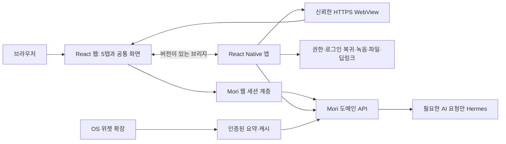

# React 웹과 React Native 앱 구현 계획

초안: 2026-10-02 · 갱신일: 2026-10-06 · 상태: 설계 방향 확정/제품 구현 전

[프론트 화면 계획](plan.md) · [당근 조사](daangn-app-research-2026-10-02.md) · [배포·버전 관리](../architecture/app-release-versioning.md) · [모바일 백엔드 계약](../back/mobile-client-contracts.md)

## 1. 채택 구조

**React + TypeScript 웹을 먼저 만들고, React Native 앱에서 react-native-webview로 같은 화면을 연다.** 네이티브는 앱 수명주기와 기기 기능을 담당한다. 기존의 Capacitor/RN 비교 상태에서 RN 컨테이너로 방향을 정한다. 당근이 전체 앱을 RN으로 만들었다는 전제는 사용하지 않는다.

초기 웹은 [Vite](https://vite.dev/guide/) 기반 SPA를 출발안으로 둔다. 로그인 이후 개인 데이터 중심이므로 초기 제품에 SSR 서버를 필수로 추가하지 않는다. 브라우저에서도 반응형 화면과 텍스트 기능을 사용할 수 있게 하되, OS 위젯·앱 종료 후 알림은 앱에서 제공한다. 지원하지 않는 기기 기능은 안내와 대체 동작으로 처리한다.

RN은 `ios/`, `android/` 프로젝트를 소유하고 Xcode/Gradle로 빌드하는 구성을 기본으로 한다. Expo/EAS는 필요하면 도입할 빌드·업데이트 도구이며 첫 출시의 필수 서비스는 아니다. 위젯 확장과 로그인 SDK의 네이티브 설정은 별도로 관리한다. 정확한 라이브러리·OS 버전은 F-09에서 두 플랫폼 빌드를 검증한 뒤 lockfile·도구 버전 파일에 고정한다.



그림의 웹 세션 계층·브리지·위젯 경로는 후속 구현이다. API·DB·Hermes·검색·GPU의 내부 주소와 인증키를 웹이나 앱에 포함하지 않는다. RN에서 사용하는 JavaScript 엔진 이름인 Hermes와 **Nous Research Hermes 에이전트는 별개**다.

## 2. 화면과 기기 기능의 소유권

| 영역 | 초기 구현 위치 | 이유/경계 |
| --- | --- | --- |
| 5탭·카드·기능 상세·마이 | React 웹 | 같은 제품 UI와 API 연결 재사용 |
| 대시보드 시간 범위·목록 | React 웹 | 지금/3/5/24시간 조회, 서버 표시 규칙 사용 |
| 캘린더 월·주·일·직접 편집 | React 웹 | 채팅과 독립된 일정 CRUD |
| 대화 패널·메시지·SSE 상태 | React 웹 | 대시보드와 대화 탭이 같은 대화 모델 사용 |
| 녹음·권한·OS 공유/파일 선택 | RN + 필요한 네이티브 모듈 | 브리지가 지원한 명령만 실행 |
| 앱 시작·오프라인 안내·업데이트 안내 | RN | 웹을 못 열어도 복구 경로 제공 |
| 알림 수신·클릭·딥링크 | RN/OS + Mori 서버 | WebView가 없어도 진입 가능 |
| 홈 화면 위젯 | iOS WidgetKit / Android 위젯 | React 웹과 별도 UI·수명주기 |
| 예약 실행·Pro 권한·개인 Pod 선택 | Mori 서버 | 앱 상태와 무관한 서버 책임 |

초기는 **주 WebView 하나**에서 탭과 상세 탐색을 관리한다. RN에 같은 5탭을 중복 구현하거나 탭마다 WebView 다섯 개를 상시 유지하지 않는다. 앱 차원의 권한 화면·녹음 화면·외부 로그인은 별도다. 성능상 필요가 확인된 화면은 같은 도메인 계약을 유지하며 RN 화면으로 옮길 수 있다.

OS 위젯은 사용자가 OS에서 추가한다. 화면 속 대시보드 카드는 표시 규칙으로 자동 배치할 수 있지만, 그것을 휴대폰 홈 화면 위젯의 강제 자동 설치로 해석하지 않는다.

## 3. master에 추가할 코드 경계

아래는 새로 만들 디렉터리 제안이다. 현재 `master`에는 제품 프론트가 없다. 기존 backend/hermes/infra 경로는 유지한다.

```text
frontend/
  apps/
    web/                 # React 화면, 웹 라우팅, API 조회/캐시
    mobile/              # RN 컨테이너, ios/, android/, 네이티브 연동
  packages/
    api-client/          # master OpenAPI 기반 타입/요청, 환경별 transport
    bridge/              # 메시지 스키마, capability, web/native 어댑터
    design-tokens/       # 색·간격·타이포그래피·모션 값
```

브라우저 전용 코드가 mobile에, RN 모듈이 web 번들에 들어가지 않게 의존성을 나눈다. 공통으로 공유할 수 있는 데이터·검증·디자인 토큰만 공유하며 HTML 컴포넌트를 RN 컴포넌트로 자동 변환하지 않는다. 웹의 API transport는 같은 origin의 세션 프록시, native transport는 안전하게 저장한 기기 세션을 사용한다.

PoC의 화면·마스코트·시나리오·인수 사례를 참고해 옮긴다. localStorage 데모 데이터, 가짜 예약 성공, 테스트 토큰·PoC 서버를 제품의 영속 저장이나 인증으로 가져오지 않는다. 기존 Word 기획서는 디자인 검토 자료이고 실제 필드·오류는 master OpenAPI와 최신 계획을 따른다.

## 4. 탐색·레이아웃·모션 규칙

- 뒤로가기는 키보드/현재 모달 → 열린 대화 패널 → 상세 화면 → 탭 루트 순서를 명시한다. RN과 웹이 동시에 같은 back을 처리하지 않는다. Android 시스템 back과 iOS 제스처도 실제 기기에서 검증한다.
- 탭을 바꿔도 각 탭의 스크롤·선택 날짜·작성 초안을 보존한다. 상세 화면은 URL에 리소스 ID를 표현하고 재실행 시 서버 소유권을 확인한다.
- safe area와 키보드 여백의 적용 주체를 한 곳으로 정한다. 앱이 제공하는 inset과 웹의 CSS inset을 중복 더하지 않는다. 브라우저에서는 웹 어댑터가 처리한다.
- 기존 공통 select/바텀시트·spacing·letter spacing·터치 영역을 디자인 토큰으로 옮긴다. 다크 모드·글자 확대·모션 감소를 웹과 RN에서 일치시킨다.
- 애니메이션은 패널·카드·녹음의 상태 전환에 집중한다. 이미지 크기 지정, 목록 페이지 처리, 화면 단위 코드 분할로 초기 로딩과 메모리를 줄인다.
- Stackflow는 상세 뒤로가기·스크롤 복원·채팅 패널 중첩을 소규모로 검증한 후 채택한다. 도입 시 라우터/화면 스택의 주체를 하나로 유지한다. [공식 소개](https://stackflow.so/docs/get-started/introduction)

## 5. 브리지 계약 v1 초안

웹에서 `window.ReactNativeWebView.postMessage`로 문자열 메시지를 보내고 RN의 `onMessage`에서 수신하는 전송 방식을 사용한다. 메시지 형태와 권한 검증은 Mori가 구현해야 한다. 단순히 WebView를 설치했다고 기기 기능이 연결되는 것은 아니다. [공식 가이드](https://github.com/react-native-webview/react-native-webview/blob/master/docs/Guide.md)

```json
{
  "protocolVersion": 1,
  "requestId": "한 호출의 고유 ID",
  "pageSessionId": "현재 웹 로드 세대 ID",
  "type": "request",
  "method": "audio.start",
  "payload": {}
}
```

응답은 같은 ID와 `ok`, `data` 또는 `error.code`를 사용한다. `UNSUPPORTED`, `PERMISSION_DENIED`, `CANCELLED`, `TIMEOUT`, `INVALID_MESSAGE`를 구분한다. 알 수 없는 method·잘못된 입력·기한 지난 응답을 실행하거나 성공으로 표시하지 않는다. 페이지가 재로드되면 이전 pending 호출을 해제하고 늦은 응답을 새 화면에 전달하지 않는다.

| 메서드/이벤트 후보 | 범위 |
| --- | --- |
| `app.handshake` | platform, 앱 build, protocol, 지원 capability, theme/insets |
| `auth.login`, `auth.logout`, `auth.changed` | 소셜 로그인 시작·상태 변경; 장기 토큰을 웹에 반환하지 않음 |
| `audio.start/stop/cancel` | 사용자가 시작한 녹음, 제한된 파일 핸들/상태 |
| `file.pick`, `file.share` | 허용 유형·크기·소유권에 맞는 선택/공유 |
| `link.openExternal` | 검증한 외부 URL을 브리지 없는 외부 브라우저로 열기 |
| `navigation.back`, `app.resume` | 단일 탐색 주체에 전달하는 이벤트 |
| `notification.requestPermission` | 설명 후 OS 권한 요청; 실제 전달 성공과 구분 |

지원 capability와 현재 OS 권한 허용 여부는 다르다. `audio.start` 지원 앱에서도 마이크 권한이 거부될 수 있다. 웹은 capability를 확인한 뒤 호출하고, RN은 매 호출마다 권한과 입력을 검증한다. 초기 일반 호출 timeout은 10초를 출발값으로 두되 OS 권한·사용자 파일 선택은 별도 수명주기와 취소를 둔다.

허용한 HTTPS origin/경로의 주 프레임에서만 브리지를 활성화한다. origin allowlist만 믿지 않고 실제 탐색·리다이렉트·새 창·메시지 입력을 검증한다. 초기에는 외부 iframe과 임의 스크립트를 허용하지 않는다. 외부 검색 본문·Markdown·사용자 기능 결과는 정해진 렌더러로 표시하고 script 실행을 차단한다. 임의 JavaScript 실행, 기기 파일 경로 읽기, 임의 URL에 인증 요청을 보내는 범용 명령은 만들지 않는다.

## 6. 로그인·세션·계정 전환

현재 API에는 소셜 로그인 시작, 서버 callback, 일회용 코드+verifier 교환, refresh, 현재 세션 logout이 있다. RN에서도 이 흐름을 재사용한다. [추가 계약과 현행 경계](../back/mobile-client-contracts.md)

```text
RN에서 verifier/state 생성
 → 시스템 인증 브라우저로 Mori 소셜 로그인 시작
 → 네이버/카카오 → Mori 서버 callback
 → 허용한 앱 복귀 주소에 일회용 code/state
 → RN이 state 확인 후 code + verifier 교환
 → refresh token은 OS 보안 저장소, access token은 필요한 범위에 보관
 → 후속 WebView 세션 교환으로 HttpOnly 웹 세션 수립
 → 같은 사용자의 대시보드 로드
```

시스템 브라우저의 cookie가 WebView와 공유된다고 가정하지 않는다. 별도의 **짧은 수명·일회성 WebView 세션 교환**을 추가하고 원래 Mori 로그인 세션과 연결한다. native refresh token을 URL·브리지·localStorage에 넘기지 않는다. 기존 PoC 프록시를 운영용 구현으로 간주하지 않는다. 웹에서 직접 로그인할 때는 서버 세션 계층이 토큰을 보관하고 Secure/HttpOnly 쿠키로 연결한다.

로그아웃은 서버 세션과 연결된 웹 세션·기기 바인딩을 해제하고 로컬 대화/카드 캐시·임시 음성·위젯 스냅샷을 지운다. 실패 시 재연결 후 서버 해제를 재시도하되 로컬에는 이전 계정의 정보를 남기지 않는다. 다른 기기 전체 로그아웃은 현행 API와 별도 정책이다.

## 7. 채팅·음성·파일의 실제 연결

웹의 `fetch` POST SSE로 기존 채팅 API를 호출한다. 웹 세션 프록시도 응답을 버퍼링하지 않고 전달한다. 실제 이벤트만 진행 단계로 표현하며 개인 추론 내용을 화면 문구로 만들어내지 않는다. 패널 닫기만으로 요청을 취소하지 않도록 연결 수명을 화면 컴포넌트와 분리한다.

앱 백그라운드·네트워크 전환으로 연결이 끊길 수 있다. 복귀 시 run/대화 기록을 조회하고 기존 요청 키로 중복 전송을 방지한다. **현재 서버는 영속 작업 큐가 아니므로 앱 종료 후 실행 완료를 보장하지 않는다.** 이벤트 무손실 재생이나 SSE 자동 재개가 구현된 것으로 가정하지 않는다.

음성은 native 녹음 → 전사 → 같은 대화 ID의 텍스트 요청 흐름이다. 전사 제공자·업로드 API는 후속 구현이다. 녹음 파형, 전사 대기, agent 실행 상태를 구분하고 실패 시 다시 녹음/텍스트 수정으로 이어간다.

문서는 현행 TXT/MD/CSV, UTF-8 **10,000,000 bytes** 한도를 따른다. 목록에서는 `size_bytes` 등 메타데이터만 가져오고 상세/다운로드 때 원문을 조회한다. 파일 전체나 base64를 브리지 메시지에 넣지 않으며 제한된 핸들과 업로드/다운로드 transport를 사용한다. Office/HWP/PDF 지원은 현재 텍스트 API로 완료된 것이 아니다.

## 8. 위젯·알림·앱 종료 상태

위젯은 Mori의 인증된 요약 API/기기 캐시에서 주차·일정·뉴스 요약과 표시 구간을 읽는다. WebView나 사용자 Hermes Pod를 켜야만 위젯을 그릴 수 있는 구조로 만들지 않는다. 서버는 다음 표시 구간까지 제공하고 위젯은 가능한 범위의 timeline/갱신 요청을 사용한다. **OS가 갱신 시점을 제어하므로 08:30 정각 갱신을 보장하지 않는다.** 마지막 갱신 시각과 오래된 데이터 상태를 표시한다. [WidgetKit 갱신](https://developer.apple.com/documentation/widgetkit/keeping-a-widget-up-to-date), [Android 위젯 갱신](https://developer.android.com/develop/ui/views/appwidgets/advanced)

30분 뒤 알림은 서버 목표 시각과 native 예약/푸시 전달 경로로 구현한다. OS 권한·절전·네트워크·기기별 중복을 다룬다. 뉴스 AI 예약은 Mori/Hermes의 별도 예약 계약을 따르며 RN JavaScript 타이머를 서버 scheduler로 사용하지 않는다.

알림·위젯을 누르면 `대상 종류 + 서버 리소스 ID`를 가진 검증된 딥링크를 해석한다. 앱이 종료돼 있었다면 앱 시작 → 세션 복구/로그인 → 리소스 조회/권한 확인 → 상세로 간다. 리소스 삭제·권한 상실이면 설명 가능한 빈 상태를 보여준다. 임의 웹 주소나 user_id를 신뢰해 바로 이동하지 않는다.

## 9. 개발 순서와 인수 기준

| 단계 | 작업 | 완료 기준 |
| --- | --- | --- |
| F-09 | React/RN 기반과 브리지 최소 실험 | 같은 주차 화면을 브라우저/iOS/Android에서 열기, handshake·뒤로가기·키보드·녹음 권한 검증 |
| B-18 | 웹 세션/모바일 로그인 연계 | 현행 소셜 계정으로 로그인→웹 사용→갱신→로그아웃, 이전 계정 캐시 없음 |
| F-10 | 실제 화면 이전 | 마이→주차/대시보드→채팅/SSE→캘린더→메모/문서→기능 순서로 실제 API 연결 |
| A-06 | staging 배포·호환 정책 | 앱 두 build와 웹 두 release의 호환/복귀 검증, 서명된 내부 테스트 앱 배포 |
| F-11 / B-19 | 음성·위젯·알림 | 기기 등록/해제, 전사, 앱 종료·권한 거부·중복 전달·스냅샷 만료 검증 |
| A-07 | 스토어 출시 | 지원 OS·심사 항목·서명/버전·롤백 절차 확인 후 단계 배포 |

F-09에서는 가짜 데이터로 프레임워크 경계를 확인할 수 있지만 F-10 완료는 실제 API 저장·재조회가 기준이다. 첫 번째 제품 기능은 **소셜 로그인 → 주차 저장 → 현재 표시 규칙에 맞는 대시보드 → 같은 계정의 채팅 진행 상태**로 잡는다. 예약·푸시가 미구현이면 준비 중 상태를 유지한다.

최소 실기기 사례는 폰/태블릿 회전, 글자 확대·모션 감소, 브라우저와 WebView, 새/구 앱, 느린 망·오프라인·앱 재시작, 외부 링크, 로그인 취소, 계정 전환, 중복 메시지다. 성능은 앱 시작→첫 카드, 상세 전환, 메모리, 채팅 이벤트 지연을 각각 측정한다. Hermes 콜드 스타트 시간을 UI 초기 로딩과 섞어 평가하지 않는다.

## 10. 이번 결정의 상태

이 문서로 RN 컨테이너 방향을 정했다. 정확한 패키지 버전·앱 ID·도메인·최소 OS·전사 제공자는 구현 단계에서 확정한다. 기존 `poc` UI나 사용자 수정 Word 파일은 이번 계획 갱신으로 바꾸지 않는다. 원격 웹 배포와 앱스토어 배포의 실행 절차·버전 정책은 [릴리스 계획](../architecture/app-release-versioning.md)이 기준이다.
